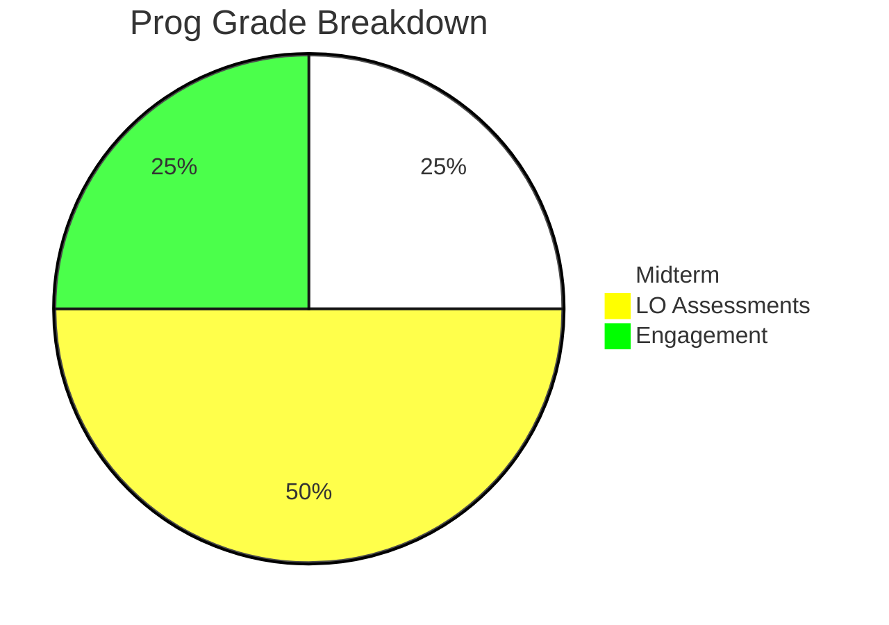
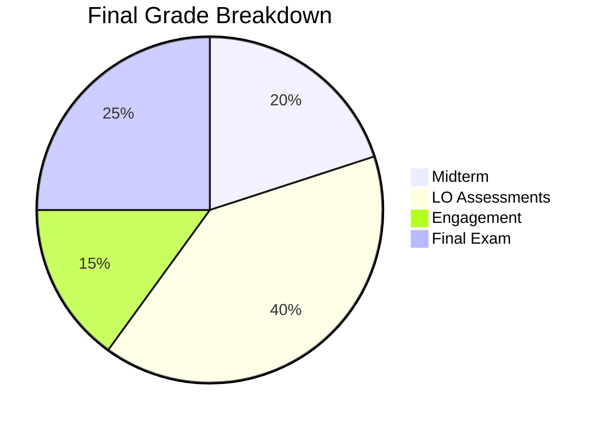

Download a PDF copy of the syllabus [here](/assets/pdf/ECE343_Syllabus_Spring%202025.pdf)

# Course Description
At its core, electromagnetics is the study of wave propagation. How do electromagnetic waves differ from the 
classical understanding of circuits? If they are indeed different, how do we deal with that and use it to our 
advantage? How does this fundamental understanding of electromagnetics enable key aspects of modern life? An 
understanding of electromagnetics is a crucial part of any Electrical Engineer's toolset; in this course, we will 
explore wave propagation to answer some of these questions &  more.

# Instructor
Dr. Neil Rogers (Course Director), [neil.rogers.@afacademy.edu](mailto:neil.rogers.@afacademy.edu)

Fairchild 2E38

# Course Goals & Objectives
Cadets enrolled in the course shall develop the ability to analyze and understand electrostatics, magnetostatics, 
and electromagnetic-wave propagation and their roles in modern electronic systems.

1. Solve transmission-line problems using their knowledge of electromagnetics to include impedance matching 
techniques, circuit parameters and the Smith chart.
2. Explain the meaning of Maxwell’s equations, in both static and dynamic situations and apply them to the study of 
   electromagnetics
3. Set up and solve electromagnetic propagation problems.

# Course Prerequistes 

1. **Physics 215:** Coulomb, Faraday, Ampere,  Gauss’ laws.
2. **ECE 346:** Divergence, gradient, curl, including divergence theorem and Stoke’s theorem, partial differential 
   equations (specifically separation of variables). 
	
# Course Text 

Ellingson, Steven W. (2018) Electromagnetics, Vol. 1. Blacksburg, VA: VT Publishing. [https://doi.org/10.
21061/electromagnetics-vol-1](https://doi.org/10.21061/electromagnetics-vol-1) CC BY-SA 4.0

# Grading
Grades in this course will be assigned based on your **mastery** of learning objectives, **engagement** in course 
material, and traditional **exams**.

[//]: # ()

## Weightings

## Grade Scale

| **Grade** | **Range** |
| A | > 93 | 
| A- | \[90, 93\) |
| B+ | \[87, 90 \) |
| B | \[84, 87 \) |
| B- | \[80, 84 \) |
| C+ | \[77, 80 \) |
| C | \[74, 77 \) |
| C- | \[70, 74 \) |
| D | \[60, 70 \) |
| F | < 60 |

## Assignment Descriptions

**Assessments** will be given for each learning objective. Assessments are graded on a binary scale, based 
on demonstrated mastery. Earning a 1 on an assessment indicates mastery of the associated learning objective. Earning a  indicates you have not yet mastered the learning objective. You may revise your work, based on the detailed feedback, unless no effort is evident (the assessment is blank, incomplete, or significantly late); then you will not be allowed a retake. A retake may be earned by giving a 5 minute technical presentation during class on a relevant topic.
	
**GRs and the Final Exam** are individual efforts. The GR will be taken out of class and will be graded on a 
specification scale of: 0, 0.5, and 1 for each problem. The final exam will be taken during the assigned period during finals week and will be graded similarly.  \\

**Engagement Credits (EC)** You may earn engagement points by engaging with the course content in the following ways:
	- Completing **practice problems**
	- Attending **EI**
	- Up to 5 engagement points may be earned for completing a **research paper** on a relevant, pre-approved 
topic. The paper must be in IEEE format, contain at least 3 scholarly references, and adhere to submission standards contained in this syllabus.

# Learning Objectives

<table style="width: 100%; border-collapse: collapse;">
  <thead>
    <tr style="background-color: #d3d3d3;">
      <th style="border: 1px solid; text-align: center;">Obj</th>
      <th style="border: 1px solid; text-align: center;">Description</th>
    </tr>
  </thead>
  <tbody>
    <!-- Chapter 1 -->
    <tr style="background-color: #f2f2f2;">
      <td colspan="2" style="border: 1px solid; text-align: center;"><strong>Chapter 1: Introduction</strong></td>
    </tr>
    <tr>
      <td style="border: 1px solid; text-align: center;">1.1</td>
      <td style="border: 1px solid;">I can articulate what I will learn and how I will be assessed in this course.</td>
    </tr>
    <tr>
      <td style="border: 1px solid; text-align: center;">1.2</td>
      <td style="border: 1px solid;">I can articulate practical applications of electromagnetics.</td>
    </tr>
    <!-- Chapter 2 -->
    <tr style="background-color: #f2f2f2;">
      <td colspan="2" style="border: 1px solid; text-align: center;"><strong>Chapter 2: Fields</strong></td>
    </tr>
    <tr>
      <td style="border: 1px solid; text-align: center;">2.2</td>
      <td style="border: 1px solid;">I can recall the definition of scalar fields, vector fields, phasors, and Euler's identity.</td>
    </tr>
    <tr>
      <td style="border: 1px solid; text-align: center;">2.1</td>
      <td style="border: 1px solid;">I can explain the basic terms and quantities used to describe electromagnetic fields.</td>
    </tr>
    <!-- Chapter 3 -->
    <tr style="background-color: #f2f2f2;">
      <td colspan="2" style="border: 1px solid; text-align: center;"><strong>Chapter 3: Transmission 
Lines</strong></td>
    </tr>
    <tr>
      <td style="border: 1px solid; text-align: center;">3.1</td>
      <td style="border: 1px solid;">I can describe the origin of the transmission line equation, understand the method of developing a solution, and interpret the solution.</td>
    </tr>
    <tr>
      <td style="border: 1px solid; text-align: center;">3.2</td>
      <td style="border: 1px solid;">I can explain the physical meaning of and calculate the following quantities: propagation constant, phase constant, attenuation constant, characteristic impedance, VSWR, reflection coefficient, and transmission coefficient.</td>
    </tr>
    <tr>
      <td style="border: 1px solid; text-align: center;">3.3</td>
      <td style="border: 1px solid;">I can use the transmission line equation to calculate the voltage/current at an arbitrary point on a specified transmission line.</td>
    </tr>
    <tr>
      <td style="border: 1px solid; text-align: center;">3.4</td>
      <td style="border: 1px solid;">I can use the transmission line equation to match a load to a source using a length of transmission line.</td>
    </tr>
    <tr>
      <td style="border: 1px solid; text-align: center;">3.5</td>
      <td style="border: 1px solid;">I can identify the various quantities represented on the Smith Chart.</td>
    </tr>
    <tr>
      <td style="border: 1px solid; text-align: center;">3.6</td>
      <td style="border: 1px solid;">I can use a Smith Chart to design a matching network for a given source and load, using series components, parallel components, shorted stubs, and open stubs.</td>
    </tr>
    <tr>
      <td style="border: 1px solid; text-align: center;">3.7</td>
      <td style="border: 1px solid;">I can measure the reflection coefficient across a range of frequencies and interpret the measurement using a network analyzer.</td>
    </tr>
    <!-- Chapter 4 -->
    <tr style="background-color: #f2f2f2;">
      <td colspan="2" style="border: 1px solid; text-align: center;"><strong>Chapter 4: Vector Analysis</strong></td>
    </tr>
    <tr>
      <td style="border: 1px solid; text-align: center;">4.1</td>
      <td style="border: 1px solid;">I can recognize and apply common vector calculus operations, such as: gradient, divergence, curl, and Laplacian.</td>
    </tr>
    <tr>
      <td style="border: 1px solid; text-align: center;">4.2</td>
      <td style="border: 1px solid;">I can recognize and perform calculations using common vector calculus operations, such as: gradient, divergence, curl, and Laplacian.</td>
    </tr>
    <tr>
      <td style="border: 1px solid; text-align: center;">4.3</td>
      <td style="border: 1px solid;">I can differentiate between Stokes' Theorem and the Divergence Theorem and apply them to various problems to simplify integrals.</td>
    </tr>
    <!-- Chapter 5 -->
    <tr style="background-color: #f2f2f2;">
      <td colspan="2" style="border: 1px solid; text-align: center;"><strong>Chapter 5: Electrostatics</strong></td>
    </tr>
    <tr>
      <td style="border: 1px solid; text-align: center;">5.1</td>
      <td style="border: 1px solid;">I can apply Coulomb's Law to use direct integration to calculate the electric field due to charge density in various geometries, including rectangular, cylindrical, and spherical coordinate systems.</td>
    </tr>
    <tr>
      <td style="border: 1px solid; text-align: center;">5.2</td>
      <td style="border: 1px solid;">I can apply the integral and differential forms of Gauss' Law to calculate the electric field due to charge density in various geometries, including rectangular, cylindrical, and spherical coordinate systems.</td>
    </tr>
    <tr>
      <td style="border: 1px solid; text-align: center;">5.3</td>
      <td style="border: 1px solid;">I can calculate the electric field from the scalar electric potential in a variety of geometries.</td>
    </tr>
    <tr>
      <td style="border: 1px solid; text-align: center;">5.4</td>
      <td style="border: 1px solid;">I can apply the electric field boundary conditions to calculate electric fields on both sides of a material boundary.</td>
    </tr>
<!-- Chapter 6 -->
    <tr style="background-color: #f2f2f2;">
      <td colspan="2" style="border: 1px solid; text-align: center;"><strong>Chapter 6: Steady Current and 
Conductivity</strong></td>
    </tr>
    <tr>
      <td style="border: 1px solid; text-align: center;">6.1</td>
      <td style="border: 1px solid;">I can calculate the total current through a surface area given a current distribution.</td>
    </tr>
    <tr>
      <td style="border: 1px solid; text-align: center;">6.2</td>
      <td style="border: 1px solid;">I can use Ohm's Law for electromagnetics to calculate the relationship between a current distribution and an electric field.</td>
    </tr>
    <tr>
      <td style="border: 1px solid; text-align: center;">6.3</td>
      <td style="border: 1px solid;">I can articulate and identify what makes a material a good conductor and how conductivity relates to resistance.</td>
    </tr>
<!-- Chapter 7 -->
 <tr style="background-color: #f2f2f2;">
      <td colspan="2" style="border: 1px solid black; text-align: center;"><strong>Chapter 7: 
Magnetostatics</strong></td>
    </tr>
    <tr>
      <td style="border: 1px solid black; text-align: center;">7.1</td>
      <td style="border: 1px solid black;">I can use the Biot-Savart law to simple magnetostatic systems to find the magnetic field at an observation point.</td>
    </tr>
    <tr>
      <td style="border: 1px solid black; text-align: center;">7.2</td>
      <td style="border: 1px solid black;">I can articulate the meaning of both the integral form and point form of Gauss' Law for magnetism.</td>
    </tr>
    <tr>
      <td style="border: 1px solid black; text-align: center;">7.3</td>
      <td style="border: 1px solid black;">I can use Ampere's Law to calculate the magnetic field at an observation point for simple magnetostatic systems.</td>
    </tr>
    <tr>
      <td style="border: 1px solid black; text-align: center;">7.4</td>
      <td style="border: 1px solid black;">I can apply the magnetic field boundary conditions to calculate magnetic fields on both sides of a material boundary.</td>
    </tr>
	<!-- Chapter 8 -->
    <tr style="background-color: #f2f2f2;">
    <td colspan="2" style="border: 1px solid black; text-align: center;"><strong>Chapter 8: Dynamic Fields</strong></td>
    </tr>
    <tr>
      <td style="border: 1px solid black; text-align: center;">8.1</td>
      <td style="border: 1px solid black;">I can articulate the significance of the displacement current and calculate it, given a time-varying electric field.</td>
    </tr>
    <tr>
      <td style="border: 1px solid black; text-align: center;">8.2</td>
      <td style="border: 1px solid black;">I can articulate the meaning of and calculate the relaxation time for a variety of materials.</td>
    </tr>
    <tr>
      <td style="border: 1px solid black; text-align: center;">8.3</td>
      <td style="border: 1px solid black;">I know the forms of Maxwell's equations for time-varying fields and use them to calculate electric and magnetic fields for a variety of physical systems.</td>
    </tr>
	<!-- Chapter 9 -->
    <tr style="background-color: #f2f2f2;">
      <td colspan="2" style="border: 1px solid black; text-align: center;"><strong>Chapter 9: Plane Waves</strong></td>
    </tr>
    <tr>
      <td style="border: 1px solid black; text-align: center;">9.1</td>
      <td style="border: 1px solid black;">I understand the process of decoupling and finding solutions for Maxwell's equations for dynamic fields.</td>
    </tr>
    <tr>
      <td style="border: 1px solid black; text-align: center;">9.2</td>
      <td style="border: 1px solid black;">I can articulate what a Uniform Plane Wave (UPW) is and describe key properties that relate the electric and magnetic field.</td>
    </tr>
    <tr>
      <td style="border: 1px solid black; text-align: center;">9.3</td>
      <td style="border: 1px solid black;">I can calculate the electric and magnetic fields for a UPW.</td>
    </tr>
    <tr>
      <td style="border: 1px solid black; text-align: center;">9.4</td>
      <td style="border: 1px solid black;">I can articulate the concept of polarization and determine the polarization for various UPWs.</td>
    </tr>
    <tr>
      <td style="border: 1px solid black; text-align: center;">9.5</td>
      <td style="border: 1px solid black;">I can determine the reflection and transmission of UPW at a boundary for Transverse Electric (TE) and Transverse Magnetic (TM) waves, using boundary conditions.</td>
    </tr>
  </tbody>
</table>

# Nominal Schedule

<table style="width: 100%; border-collapse: collapse;">
    <thead>
        <tr style="background-color: #d3d3d3;">
            <th style="border: 1px solid black; text-align: center;">Lesson</th>
            <th style="border: 1px solid black; text-align: left;">Topics</th>
            <th style="border: 1px solid black; text-align: center;">Reading</th>
            <th style="border: 1px solid black; text-align: left;">Notes</th>
        </tr>
    </thead>
    <tbody>
        <tr>
            <td style="border: 1px solid black; text-align: center;">1</td>
            <td style="border: 1px solid black; text-align: left;">Course Overview & Introduction</td>
            <td style="border: 1px solid black; text-align: center;">Ch. 1</td>
            <td style="border: 1px solid black; text-align: left;">1.1-1.2</td>
        </tr>
<tr style="background-color: #f2f2f2;">
            <td colspan="4" style="border: 1px solid black; text-align: left;"><strong>Chapter 2: Electric and Magnetic Fields</strong></td>
        </tr>
        <tr>
            <td style="border: 1px solid black; text-align: center;">2</td>
            <td style="border: 1px solid black; text-align: left;">Fields, Parameters, Field Quantities</td>
            <td style="border: 1px solid black; text-align: center;">Ch. 2</td>
            <td style="border: 1px solid black; text-align: left;">2.1-2.2</td>
        </tr>
        <tr style="background-color: #f2f2f2;">
            <td colspan="4" style="border: 1px solid black; text-align: left;"><strong>Chapter 3: Transmission Lines</strong></td>
        </tr>
        <tr>
            <td style="border: 1px solid black; text-align: center;">3</td>
            <td style="border: 1px solid black; text-align: left;">Lumped Element Model</td>
            <td style="border: 1px solid black; text-align: center;">3.1-3.4</td>
            <td style="border: 1px solid black; text-align: left;">3.1</td>
        </tr>
        <tr>
            <td style="border: 1px solid black; text-align: center;">4</td>
            <td style="border: 1px solid black; text-align: left;">Telegrapher's Equations</td>
            <td style="border: 1px solid black; text-align: center;">3.5-3.6</td>
            <td style="border: 1px solid black; text-align: left;">3.1</td>
        </tr>
        <tr>
            <td style="border: 1px solid black; text-align: center;">5</td>
            <td style="border: 1px solid black; text-align: left;">Characteristic Impedance &amp; Wave Propagation</td>
            <td style="border: 1px solid black; text-align: center;">3.7-3.9</td>
            <td style="border: 1px solid black; text-align: left;">3.2</td>
        </tr>
        <tr>
            <td style="border: 1px solid black; text-align: center;">6</td>
            <td style="border: 1px solid black; text-align: left;">Coaxial, Reflection Coefficient, VSWR</td>
            <td style="border: 1px solid black; text-align: center;">3.10, 3.12-3.14</td>
            <td style="border: 1px solid black; text-align: left;">3.2-3.3</td>
        </tr>
        <tr>
            <td style="border: 1px solid black; text-align: center;">7</td>
            <td style="border: 1px solid black; text-align: left;">Terminated Transmission Lines</td>
            <td style="border: 1px solid black; text-align: center;">3.15, 3.17-3.19</td>
            <td style="border: 1px solid black; text-align: left;">3.4</td>
        </tr>
        <tr>
            <td style="border: 1px solid black; text-align: center;">8</td>
            <td style="border: 1px solid black; text-align: left;">Impedance Matching</td>
            <td style="border: 1px solid black; text-align: center;">3.21-3.23</td>
            <td style="border: 1px solid black; text-align: left;">3.4</td>
        </tr>
        <tr>
            <td style="border: 1px solid black; text-align: center;">9</td>
            <td style="border: 1px solid black; text-align: left;">Impedance Matching</td>
            <td style="border: 1px solid black; text-align: center;">3.21-3.23</td>
            <td style="border: 1px solid black; text-align: left;">3.4</td>
        </tr>
        <tr>
            <td style="border: 1px solid black; text-align: center;">10</td>
            <td style="border: 1px solid black; text-align: left;">Smith Charts</td>
            <td style="border: 1px solid black; text-align: center;">Supplemental</td>
            <td style="border: 1px solid black; text-align: left;">3.5</td>
        </tr>
        <tr>
            <td style="border: 1px solid black; text-align: center;">11</td>
            <td style="border: 1px solid black; text-align: left;">Smith Charts</td>
            <td style="border: 1px solid black; text-align: center;">Supplemental</td>
            <td style="border: 1px solid black; text-align: left;">3.5</td>
        </tr>
        <tr>
            <td style="border: 1px solid black; text-align: center;">12</td>
            <td style="border: 1px solid black; text-align: left;">Smith Charts</td>
            <td style="border: 1px solid black; text-align: center;">Supplemental</td>
            <td style="border: 1px solid black; text-align: left;">3.5</td>
        </tr>
        <tr>
            <td style="border: 1px solid black; text-align: center;">13</td>
            <td style="border: 1px solid black; text-align: left;">Smith Charts</td>
            <td style="border: 1px solid black; text-align: center;">Supplemental</td>
            <td style="border: 1px solid black; text-align: left;">3.5</td>
        </tr>
        <tr>
            <td style="border: 1px solid black; text-align: center;">14</td>
            <td style="border: 1px solid black; text-align: left;">Transients</td>
            <td style="border: 1px solid black; text-align: center;">Supplemental</td>
            <td style="border: 1px solid black; text-align: left;">3.6</td>
        </tr>
        <tr>
            <td style="border: 1px solid black; text-align: center;">15</td>
            <td style="border: 1px solid black; text-align: left;">Reflection/Transmission Coefficient Lab</td>
            <td style="border: 1px solid black; text-align: center;">Lab Packet</td>
            <td style="border: 1px solid black; text-align: left;">3.7</td>
        </tr>
<tr style="background-color: #f2f2f2;">
            <td colspan="4" style="border: 1px solid black; text-align: left;"><strong>Chapter 4: Vector 
Analysis</strong></td>
        </tr>
        <tr>
            <td style="border: 1px solid black; text-align: center;">16</td>
            <td style="border: 1px solid black; text-align: left;">Vector &amp; Coordinate System Review</td>
            <td style="border: 1px solid black; text-align: center;">Ch. 4</td>
            <td style="border: 1px solid black; text-align: left;">4.1-4.4, <strong>GR 1 due</strong></td>
        </tr>
        <tr style="background-color: #f2f2f2;">
            <td colspan="4" style="border: 1px solid black; text-align: left;"><strong>Chapter 5: 
Electrostatics</strong></td>
        </tr>
        <tr>
            <td style="border: 1px solid black; text-align: center;">17</td>
            <td style="border: 1px solid black; text-align: left;">Coulomb's Law</td>
            <td style="border: 1px solid black; text-align: center;">5.1-5.3</td>
            <td style="border: 1px solid black; text-align: left;">5.1</td>
        </tr>
        <tr>
            <td style="border: 1px solid black; text-align: center;">18</td>
            <td style="border: 1px solid black; text-align: left;">Surface and Volume Charge</td>
            <td style="border: 1px solid black; text-align: left;">5.4</td>
            <td style="border: 1px solid black; text-align: left;">5.1</td>
        </tr>
        <tr>
            <td style="border: 1px solid black; text-align: center;">19</td>
            <td style="border: 1px solid black; text-align: left;">Gauss' Law (Integral Form)</td>
            <td style="border: 1px solid black; text-align: left;">5.5-5.6</td>
            <td style="border: 1px solid black; text-align: left;">5.2</td>
        </tr>
        <tr>
            <td style="border: 1px solid black; text-align: center;">20</td>
            <td style="border: 1px solid black; text-align: left;">Gauss' Law (Differential Form)</td>
            <td style="border: 1px solid black; text-align: left;">5.7-5.8</td>
            <td style="border: 1px solid black; text-align: left;">5.2</td>
        </tr>
        <tr>
            <td style="border: 1px solid black; text-align: center;">21</td>
            <td style="border: 1px solid black; text-align: left;">Electric Potential</td>
            <td style="border: 1px solid black; text-align: left;">5.9-5.10, 5.15</td>
            <td style="border: 1px solid black; text-align: left;">5.3</td>
        </tr>
        <tr>
            <td style="border: 1px solid black; text-align: center;">22</td>
            <td style="border: 1px solid black; text-align: left;">BVP (Capacitor, Coax), Electric Potential</td>
            <td style="border: 1px solid black; text-align: left;">5.16</td>
            <td style="border: 1px solid black; text-align: left;">5.3</td>
        </tr>
        <tr>
            <td style="border: 1px solid black; text-align: center;">23</td>
            <td style="border: 1px solid black; text-align: left;">Electric Boundary Conditions</td>
            <td style="border: 1px solid black; text-align: left;">5.18-5.22</td>
            <td style="border: 1px solid black; text-align: left;">5.4</td>
        </tr>
        <tr>
            <td style="border: 1px solid black; text-align: center;">24</td>
            <td style="border: 1px solid black; text-align: left;">Capacitance</td>
            <td style="border: 1px solid black; text-align: left;">5.23-5.24</td>
            <td style="border: 1px solid black; text-align: left;"> </td>
        </tr>
        <tr>
            <td style="border: 1px solid black; text-align: center;">25</td>
            <td style="border: 1px solid black; text-align: left;">Electrostatic Lab</td>
            <td style="border: 1px solid black; text-align: left;">Lab Packet</td>
            <td style="border: 1px solid black; text-align: left;"> </td>
        </tr>
        <tr style="background-color: #f2f2f2;">
            <td colspan="4" style="border: 1px solid black; text-align: left;"><strong>Chapter 6: 
Steady Current and Conductivity</strong></td>
        </tr>
        <tr>
            <td style="border: 1px solid black; text-align: center;">26</td>
            <td style="border: 1px solid black; text-align: left;">Current density, Conductivity, Resistance</td>
            <td style="border: 1px solid black; text-align: left;">Chapter 6</td>
            <td style="border: 1px solid black; text-align: left;">6.1-6.3</td>
        </tr>
        <tr style="background-color: #f2f2f2;">
            <td colspan="4" style="border: 1px solid black; text-align: left;"><strong>Chapter 7: 
Magnetostatics</strong></td>
        </tr>
        <tr>
            <td style="border: 1px solid black; text-align: center;">27</td>
            <td style="border: 1px solid black; text-align: left;"> Magnetic Fields, Gauss' Law for Magnetism</td>
            <td style="border: 1px solid black; text-align: left;">7.1-7.3</td>
            <td style="border: 1px solid black; text-align: left;">7.1-7.2</td>
        </tr>
        <tr>
            <td style="border: 1px solid black; text-align: center;">28</td>
            <td style="border: 1px solid black; text-align: left;">Ampere's Law</td>
            <td style="border: 1px solid black; text-align: left;">7.4-7.5,7.9</td>
            <td style="border: 1px solid black; text-align: left;">7.3</td>
        </tr>
        <tr>
            <td style="border: 1px solid black; text-align: center;">29</td>
            <td style="border: 1px solid black; text-align: left;">Ampere's Law Applied</td>
            <td style="border: 1px solid black; text-align: left;">7.6-7.8</td>
            <td style="border: 1px solid black; text-align: left;">7.3</td>
        </tr>
        <tr>
            <td style="border: 1px solid black; text-align: center;">30</td>
            <td style="border: 1px solid black; text-align: left;">Magnetic Boundary Conditions</td>
            <td style="border: 1px solid black; text-align: left;">7.10-7.14</td>
            <td style="border: 1px solid black; text-align: left;">7.4</td>
        </tr>
        <tr>
            <td style="border: 1px solid black; text-align: center;">31</td>
            <td style="border: 1px solid black; text-align: left;">Magnetostatics Lab</td>
            <td style="border: 1px solid black; text-align: left;">Lab Packet</td>
            <td style="border: 1px solid black; text-align: left;"> </td>
        </tr>
      <tr style="background-color: #f2f2f2;">
            <td colspan="4" style="border: 1px solid black; text-align: left;"><strong>Chapter 8: 
Dynamic Fields</strong></td>
        </tr>
        <tr>
            <td style="border: 1px solid black; text-align: center;">32</td>
            <td style="border: 1px solid black; text-align: left;">Faraday's Law, Displacement Current, Maxwell Eqns</td>
            <td style="border: 1px solid black; text-align: left;">8.3, 8.8, 8.9</td>
            <td style="border: 1px solid black; text-align: left;">8.1</td>
        </tr>
        <tr>
            <td style="border: 1px solid black; text-align: center;">33</td>
            <td style="border: 1px solid black; text-align: left;">Faraday's Law, Displacement Current, Maxwell Eqns</td>
            <td style="border: 1px solid black; text-align: left;">8.3, 8.8, 8.9</td>
            <td style="border: 1px solid black; text-align: left;">8.2-8.3</td>
        </tr>
      <tr style="background-color: #f2f2f2;">
            <td colspan="4" style="border: 1px solid black; text-align: center;"><strong>Chapter 9: 
Uniform Plane Waves in Lossless Media</strong></td>
        </tr>
        <tr>
            <td style="border: 1px solid black; text-align: center;">34</td>
            <td style="border: 1px solid black; text-align: left;">Maxwell's Equations in lossless, source-free region</td>
            <td style="border: 1px solid black; text-align: left;">9.1-9.2</td>
            <td style="border: 1px solid black; text-align: left;">9.1</td>
        </tr>
        <tr>
            <td style="border: 1px solid black; text-align: center;">35</td>
            <td style="border: 1px solid black; text-align: left;">Maxwell's Equations in lossless, source-free region</td>
            <td style="border: 1px solid black; text-align: left;">9.1-9.2</td>
            <td style="border: 1px solid black; text-align: left;">9.1</td>
        </tr>
        <tr>
            <td style="border: 1px solid black; text-align: center;">36</td>
            <td style="border: 1px solid black; text-align: left;">Maxwell's Equations in lossless, source-free region</td>
            <td style="border: 1px solid black; text-align: left;">9.1-9.2</td>
            <td style="border: 1px solid black; text-align: left;">9.1</td>
        </tr>
        <tr>
            <td style="border: 1px solid black; text-align: center;">37</td>
            <td style="border: 1px solid black; text-align: left;">UPW and Polarization</td>
            <td style="border: 1px solid black; text-align: left;">9.4-9.6</td>
            <td style="border: 1px solid black; text-align: left;">9.2-9.3</td>
        </tr>
         <tr style="background-color: #f2f2f2;">
            <td style="border: 1px solid black; text-align: center;">38</td>
            <td style="border: 1px solid black; text-align: left;">Normal Incidence</td>
            <td style="border: 1px solid black; text-align: left;">Vol 2, 5.6-5.7</td>
            <td style="border: 1px solid black; text-align: left;">9.4</td>
        </tr>
        <tr>
            <td style="border: 1px solid black; text-align: center;">39</td>
            <td style="border: 1px solid black; text-align: left;">Oblique Incidence</td>
            <td style="border: 1px solid black; text-align: left;">Vol 2, 5.6-5.7</td>
            <td style="border: 1px solid black; text-align: left;">9.5</td>
        </tr>
        <tr>
            <td style="border: 1px solid black; text-align: center;">40</td>
            <td style="border: 1px solid black; text-align: left;">Incidence Lab</td>
            <td style="border: 1px solid black; text-align: left;">Lab Packet</td>
            <td style="border: 1px solid black; text-align: left;"> </td>
        </tr>

    </tbody>
</table>

# Course Policies

You have chosen one of the most difficult majors at USAFA - I applaud your commitment! My role in your journey is to 
enable your success. My intent is to do this by creating an inclusive environment and putting in the work **with** 
you. If you work hard and communicate with me, I will do everything in our power to make sure you succeed. 
Have questions? Ask -- I genuinely believe there's no such thing as a stupid question. Have concerns, especially 
about your learning environment? Let's talk. You face many challenges here at USAFA; I am in your corner -- so let's go!

1. **Absences**  
   In the event of an absence, communicate with me **beforehand.** If a cadet will miss any graded event due to a scheduled absence such as an SCA, sport team trip, or scheduled medical procedure, a makeup plan should be in place **before** the absence occurs. In the event of bedrest, please notify me **via email** ASAP after receiving approval.

2. **Academic Honor**  
   Your honor is extremely important. The course's academic security policies are designed to help you succeed in meeting academic requirements while practicing the honorable behavior our country rightfully demands of its military. Do not compromise your integrity by violating academic security or by taking unfair advantage of your classmates.

3. **Assignment Availability**  
   All work will be available through Teams, the course website, and/or Gradescope. A 24-hour grace period is generally observed, after which 25% of available points will be deducted for each calendar day (the first calendar day being anywhere from one minute to 24 hours after the assignment is due) the graded assignment is late. I may waive part or all of this penalty for legitimate, pre-coordinated (if possible) extenuating circumstances.

4. **Authorized Resources**  
   If applicable to this course, GRs and the Final Exam are individual effort. No collaboration is allowed while taking these exams. Although electronic devices may be authorized for viewing reference materials, use of the internet, Teams, and generative AI tools is **not** allowed during GRs and final exams.

5. **Collaboration**  
   Collaboration (not copying) on practice problems and assessments is highly encouraged, unless your instructor 
   provides direction otherwise. A good litmus test to distinguish between copying and collaboration is as follows: students must be able to explain every step indicated on their submitted work to be considered collaboration and not copying. All help received on work submitted for grading must be documented in accordance with the course documentation policy.

6. **Documentation**  
   In accordance with the Dean’s policy for documentation, all ECE assignments must have a documentation statement. For group projects, you are not required to document collaboration within your own team, as such collaboration is expected and authorized. The documentation statement should be clearly identified with the word “Documentation.” If you did not collaborate, then the statement “Documentation: None,” is appropriate. Assignments without a documentation statement are incomplete and may be returned to the student for completion. The assignment will then be assessed the appropriate penalty according to the late work policy. Your instructor may assess a 1-day-late penalty (up to 25%) in lieu of returning the assignment. In this case, a documentation statement must still be received before the grade can be posted.

7. **Extra Instruction**  
   EI is one of the best and easiest ways to succeed in this class; EI is recommended early and often. Walk-in EI is not generally available, so please book with me at the following link:  
   [Book EI](https://bit.ly/3BFvEPa)

8. **Generative AI**  
   Your instructor is pro-AI; however, I expect you to use generative AI platforms (ChatGPT, etc) as a tool rather than to complete your assignments for you. It will be very clear if you are using AI irresponsibly: ChatGPT often generates incorrect solutions to the challenging mathematical problems given in this course and many times offers methods of completing the problems that do not align with your specific course objectives. If you utilize generative AI on any assignment, include a documentation statement as outlined in the Documentation Policy. 

