<p align="justify"> 
Capture the flag (CTF) has always been my favorite part of GRCon -- not only is it a ton of fun to hack away at puzzles, but it is a great way to gain valuable experience in working with the various software tools used in DSP and Communications. When I was teaching, I would often repurpose these challenges as projects and/or exams for my students! However, due to unavoidable circumstances, our CTF was in danger of being cancelled this year. I had some extra bandwidth, as I was transitioning between jobs -- and I was already planning on being at the conference, so I volunteered to organize the event. For the past several years, @argilo has run an impeccable event, so the bar was high! Thanks to some hard work and fantastic submissions from a number of people, I think the event was a great success! Special thanks to Gary Schafer for building All the Same Color, Never the Same Color, Please Ask Later, and Signal Identification part 2.
</p>

## Always the Same Color
This challenge consists of a spectrum that is 10 MHz wide. In the center is a flat-topped signal with a spectral line on the lower end. The spectrum and the spectral line indicate an Advanced Television Systems Committee (ATSC) digitally-modulated carrier. Specifically, ATSC Ver 1. 

<figure>
  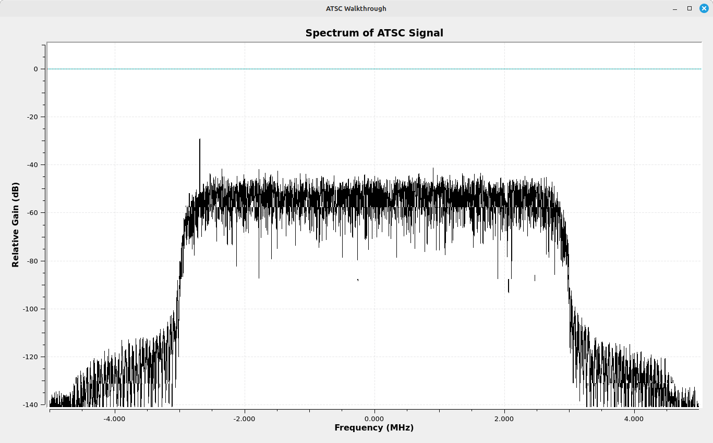
  <figcaption align="justify"><b>FigureX</b>:  Spectrum of ATSC signal. The combination of a flat-topped signal that is roughly 6 MHz wide (the span between the roughly flat sides of the signal) and the spectral line on the left end are all indicative of a ATSC signal, specifically ATSC Ver 1.</figcaption>
</figure>

<br>

<p align="justify">
GNURadio has a block that can be used to demodulate this type of signal, specifically the ATSC Receive Pipeline block. The following flowgraph incorporates this block:
</p>

<figure>
  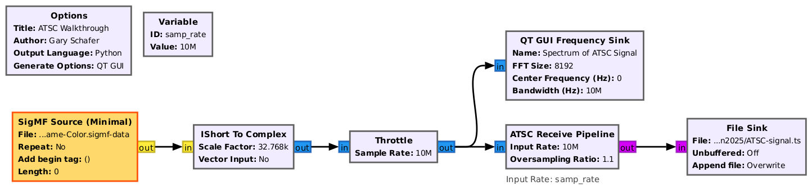
  <figcaption align="justify"><b>FigureX</b>:  Flowgraph to demodulate and decode an ATSC Ver 1 signal. This flowgraph saves the output of the ATSC Receive Pipeline to a file. NOTE: The SigMF Source block is set to a "Repeat" value of "No" and the input data type is CS16 (16-bit ints for I and 16-bits for Q) -- this saves a significant amount of data for the file upload. The output is a transport stream (TS), so the file can be saved with a .ts extension. Most video viewing software will be able to play this format.
    </figcaption>
</figure>

<p align="justify">
Using the method above (saving the transport stream as a .ts file) and using readily-available software (VLC, Celluloid, SMPlayer), playing the file provides the following initial screen (using SMPlayer on Linux):
</p>

<figure>
  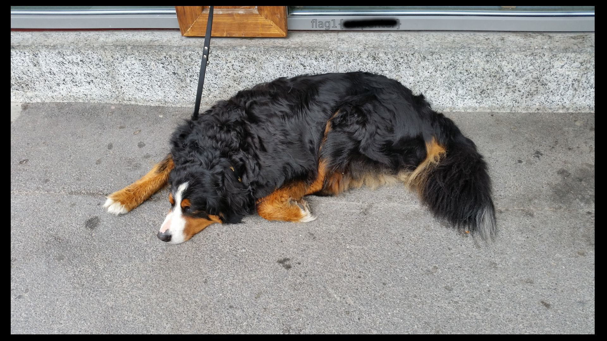
  <figcaption><b>FigureX</b>:  Video channel 1 of the .TS file. 
    </figcaption>
</figure>

<br>

<p align="justify">

One of the flags is clearly visible in video track 1 of the .TS file. Note that transport streams are simply "vessels" that can hold multiple audio and video tracks. Using your chosen video player, you should have the option to look at separate audio and video tracks. The second audio track is simply a nice little Rick Roll (you're welcome). The video, while also part of the Rick Roll, contains flag 2 in the visible area of the right side of the screen. 
</p>

<p align="justify">
The last two flags are a bit trickier. One of the clues provided is "pay attention to all that you see and hear". The "hear" part is the most important. An extra hint provided (assuming you were willing to accept the cost in points) was, "Your hearing only goes up to about 15 kHz. The sample rate for ATSC audio can be up to 48 kHz. Process accordingly." If the sample rate is 48 kHz, then the maximum frequency of that signal can be up to 24 kHz, though with filtering the resulting is typically about 80% of that, or about 20 kHz. That leaves about 5 kHz for bad actors to play with. Like me. In this 
</p>

<p align="justify">
There are a few ways to access this extra audio:
</p>

<p align="justify">
1. Play the audio track while recording with a record-what-you-hear program. NOTE: This really needs to be a uncompressed format. Recording in MP3 or a screen capture using MP4, such as is used by OBS Studio, will typically damage, if not outright destroy, this extra audio information.
</p>

<p align="justify">
2. Record the audio (again, in uncompressed format) using an audio recorder with the audio being played by your video player or by using a transmit-capable SDR to transmit the ATSC signal to an ATSC-ready TV. (NOTE: This was tested using an older Toshiba, and it actually worked. The recorder was an Android tablet with a standard audio recording program.)
</p>

<p align="justify">
3. Use the command-line program "ffmpeg" to extract the audio tracks from the .ts file. THIS IS PROBABLY THE BEST METHOD. ffmpeg will extract the audio straight to a .WAV file (uncompressed) where it can be manipulated with Gnu Radio or any of a host of audio processing programs. ffmpeg also provides a command to see all the available tracks in an audio/ video file. Running the command for our .ts file provides the following:
</p>

<br>

```
    Input #0, mpegts, from 'ATSC-signal.ts':
    Duration: 19:53:18.22, start: 23862.929422, bitrate: 4 kb/s
    Program 1 
     Metadata:
      service_name    : Service01
      service_provider: FFmpeg
    Stream #0:0[0x100]: Video: mpeg2video (Main) ([2][0][0][0] / 0x0002), yuv420p(tv, bt470bg/unknown/unknown, progressive), 1920x1080 [SAR 1:1 DAR 16:9], 30 fps, 30 tbr, 90k tbn, 60 tbc
    Side data:
      cpb: bitrate max/min/avg: 0/0/0 buffer size: 1425408 vbv_delay: N/A
    Stream #0:1[0x101](und): Audio: ac3 (AC-3 / 0x332D4341), 48000 Hz, mono, fltp, 640 kb/s
    Stream #0:2[0x102]: Video: mpeg2video (Main) ([2][0][0][0] / 0x0002), yuv420p(tv, bt470bg/unknown/unknown, progressive), 1920x1080 [SAR 1:1 DAR 16:9], 30 fps, 30 tbr, 90k tbn, 60 tbc
    Side data:
      cpb: bitrate max/min/avg: 0/0/0 buffer size: 1425408 vbv_delay: N/A
     Stream #0:3[0x103](und): Audio: ac3 (AC-3 / 0x332D4341), 48000 Hz, mono, fltp, 640 kb/s
```
<p align="justify">
This shows four "streams" (tracks), two audio and two video. Extracting the first audio track, listed as "Stream #0:1", can be done with the following command:
</p>


    ffmpeg -i ATSC-signal.ts -map 0:1 track1audio.wav

<p align="justify">
This results in a .WAV file that you can now process with any audio processing program, including Gnu Radio. For example, processing this file in Audacity (FOSS audio processing program), we see the entire signal in the time domain:
</p>

<figure>
  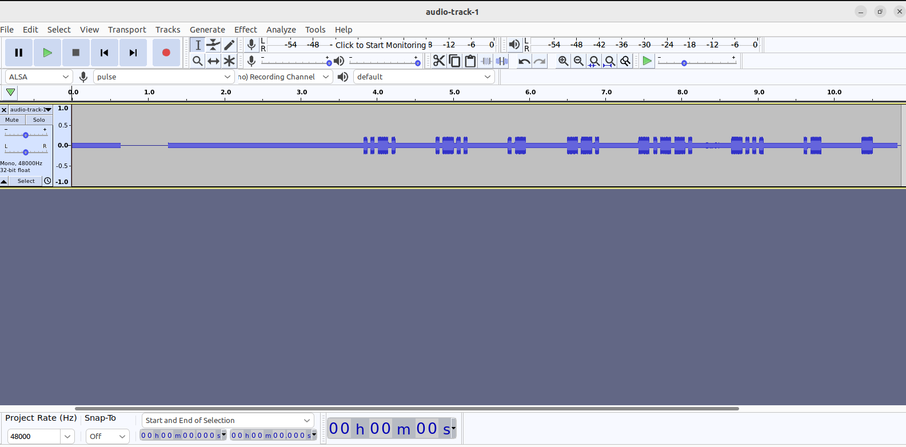
  <figcaption><b>FigureX</b>:  Audio channel 1 of the .TS file. 
    </figcaption>
</figure>

<p align="justify">
We can pipe this audio to the CW decoder of your choice. I prefer using `multimon-ng` in the terminal:
</p>

    multimon-ng -a SCOPE -a MORSE_CW

<p align="justify">
This will decode even the sped-up CW tones, although Audacity can slow down the playback through the "Effect --> Change Speed" option. 
</p>

<p align="justify">
It may not be clear from the time-based view, but there's an additional subcarrier in the audio track 1. You can see it as what would appear to be low-amplitude noise around the center point of the signal. However, if we select this signal with CTRL+A and then choose "Analyze--> Plot Spectrum" (or, view the FFT in GNURadio using a WAV source), we see the extra subcarrier very clearly around 17.5kHz:
</p>

<figure>
  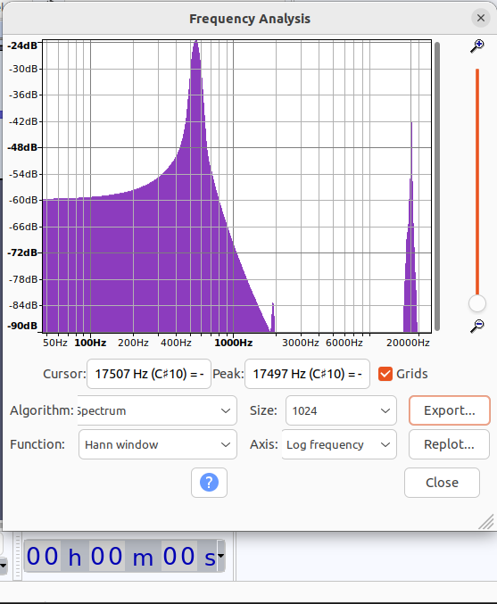
  <figcaption align="justify"><b>FigureX</b>:  The frequency content of audio channel 1 of the .TS file. 
    </figcaption>
</figure>

<p align="justify">
We can use GNURadio to isolate and demodulate that subcarrier, using our recorded .WAV file as an input. This flowgraph shifts the 17.5kHz signal to baseband, filters it, and demodulates it as NBFM (using quadrature demod). We probably didn't know at first that it was NBFM, but looking at the shifted signal (using a frequency sink or waterfall sink), it would quickly be evident this is the case.
</p>

<figure>
  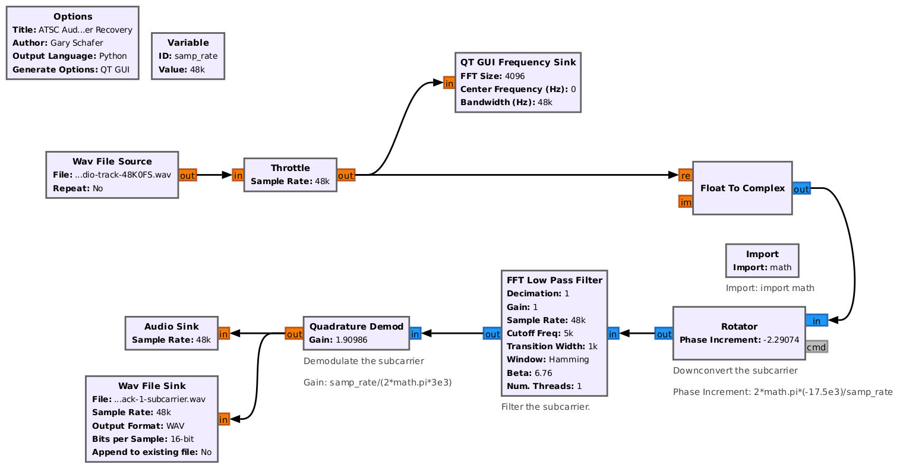
  <figcaption align="justify"><b>FigureX</b>:  Flowgraph to downconvert and demodulate the audio signal on the ATSC audio track 1. This also stores it as a .WAV file, which can then be further processed in an audio program. The audio on the subcarrier is a time-reversed voice with the flag 
    </figcaption>
</figure>

<p align="justify">
In an additional twist, listening to the output, it is unitelligible. That's because it is time-reversed. Therefore, we save the baseband audio out as a WAV file, then reverse it in Audacity ("Effect --> Reverse" menu). Finally, we hear the flag (and a congratulations message!) dictated. 
</p>

<p align="justify">
Extracting the second audio track, using the same ffmpeg command as above, but with "-map 0:3", you get a .WAV file that, when opened in a similar fashion, shows this spectrogram. Note, you can also record the audio directly out to Audacity by directing Audacity's input to the output of VLC when audio track 2 is playing.
</p>

<figure>
  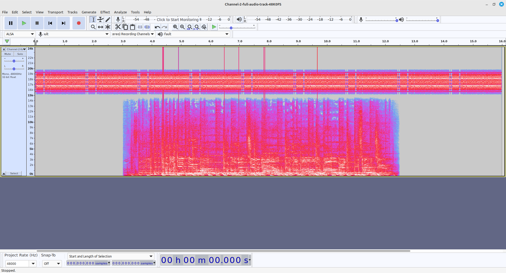
  <figcaption align="justify"><b>FigureX</b>:  The spectrogram of audio track 2. There's clearly something extra here. 
    </figcaption>
</figure>

<p align="justify">
It's not clear immediately what's going on, but we can use GNURadio to shift the bottom signal to baseband and then investigating it. By viewing the FFT output of the shifted signal, you should see this is a 2FSK signal
</p>

<p align="justify">
This flowgraph downconverts, demodulates and displays the signal on the QT GUI TIme Sink (assuming a FM modulation of some kind). To determine the number of samples per symbol, the "Sample Rate" of the time sink has been set to "1". With this setting, any measurements will be "samples".
</p>

<figure>
  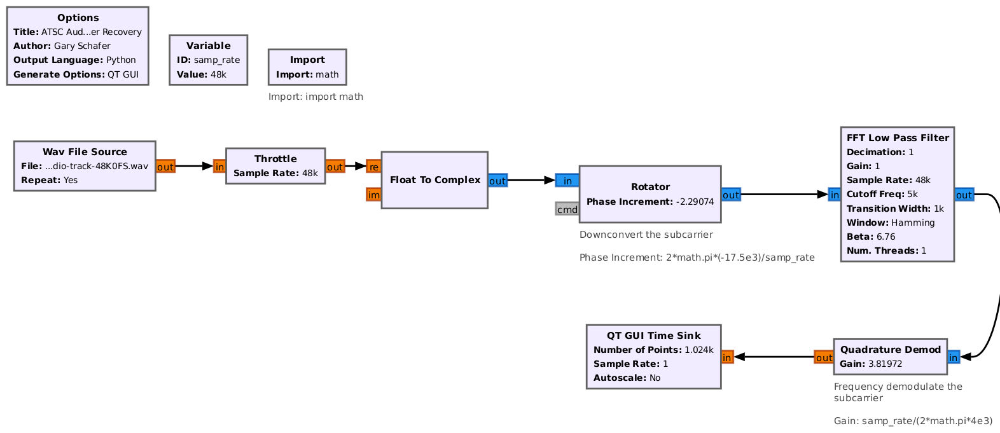
  <figcaption align="justify"><b>FigureX</b>:  Initial flowgraph to process the 17.5 kHz subcarrier on the ATSC signal audio track 2. 
    </figcaption>
</figure>

<p align="justify">
The output of this flowgraph is a time domain signal that appears to be a bitstream. 
</p>

<figure>
  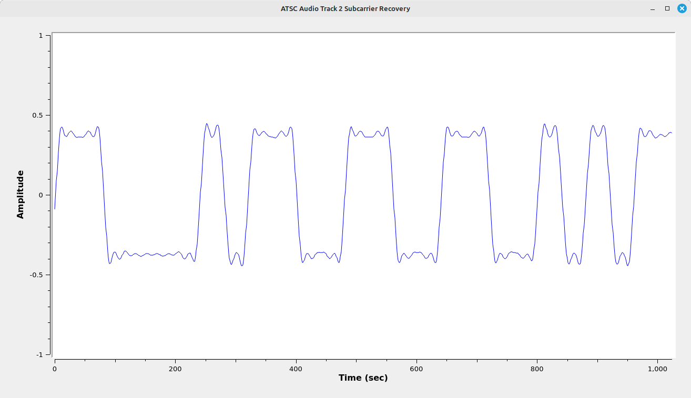
  <figcaption align="justify"><b>FigureX</b>:  Demodulated bitstream from the ATSC audio track 2 subcarrier. 
    </figcaption>
</figure>

<p align="justify">
The sample rate of this QT GUI Time Sink has been set to 1, so the horizontal axis is not "sec", but "samples". This makes it relatively straightforward (if not easy) to calculate the number of samples per symbol. This can be done by placing the cursor on either side of the narrowest bits at the halfway point vertically. In this case, the value is roughly 40 samples per symbol. After recovering the raw data stream, its possible to use the Gnu Radio "Symbol Sync" to recover the bits. Using the value of the samples per symbol calculated from the time domain display above (40 samples per symbol), the "Symbol Sync" block will output raw bits.
</p>
<p align="justify">
After recovering the raw data stream, its possible to use the Gnu Radio "Symbol Sync" to recover the bits. Using the value of the samples per symbol calculated from the time domain display above (40 samples per symbol), the "Symbol Sync" block will output raw bits.
</p>

<figure>
  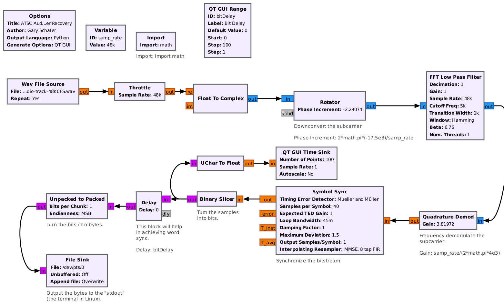
  <figcaption align="justify"><b>FigureX</b>:  Final flowgraph for recovering the flag from the subcarrier of the ATSC audio track 2. 
    </figcaption>
</figure>

<p align="justify">
FSK is, by its very nature, a differential transmission method. Hence, a differential decoder is not needed (as would typically be the case with a PSK signal). The only issue is how to determine what the bits mean. ASCII is a very common method (hence the hint mentioning "ASKEY"). The "Symbol Sync" provides bit sync, but there's still the issue of aligning the bytes to recover the ASCII properly. That's the purpose of the "Delay" block. To run the flowgraph, make sure the "stdout" (typically a terminal) is open. Once the flowgraph is running, increase the delay until text appears in the terminal. NOTE: Due to the relatively short amount of time of the recording before it starts to repeat, the byte alignment will probably need adjustment between repeats. 
</p>

<p align="justify">
Another option is saving the subcarrier as a complex file, then importing it into Universal Radio Hacker (URH). URH provides some basic tools that allow for easier "bit-busting", especially with digital too
</p>

<figure>
  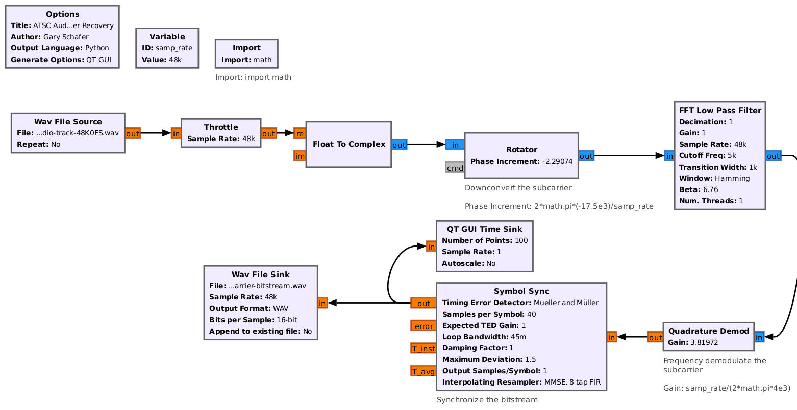
  <figcaption align="justify"><b>FigureX</b>:  A flowgraph for exporting to URH.
    </figcaption>
</figure>

<p align="justify">
Opening the resulting file in Universal Radio Hacker (URH), I got the following initial view. I'd adjusted the samples/symbol to "1" (the "Symbol Sync" block took care of that) and the "Error Tolerance" to "0".
From the "Analysis" page, you're presented with a bitstream. Changing the "View Data As" from "Bits" to "ASCII", you'll probably get a string of random characters along the top. Right-clicking on the bitstream, you get the option to make the stream "Writeable". Doing so allows you to go back to viewing as "Bits", delete the first bit, switch back to "ASCII" and see if any text appears. Rinse and repeat if you get weird, random characters. At some point, you should see text appear.
</p>

<figure>
  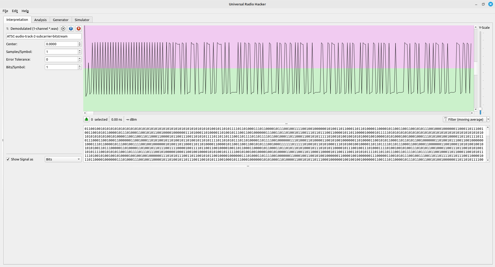
  <figcaption align="justify"><b>FigureX</b>:  Universal Radio Hacker showing decoding of the ATSC audio track 2 subcarrier. The result is a string of ASCII text with the final flag.
    </figcaption>
</figure>


## Catch 'Em All

> Coming soon
{: .prompt-info }

This was a 


## Hop to It

> Coming soon
{: .prompt-info }
> 
## In-Person

> Coming soon
{: .prompt-info }

## Never the Same Color (revisited)

<p align="justify">
Never the Same Color is a play on the abbreviation for National Television System Committee (NTSC), the original US analog television standard created in the 1940s. From a signal standpoint, the NTSC standard defines both the baseband (information) signal in addition to the modulated signal. Unlike ATSC, where all the information is contained within a single bitstream, the NTSC standard uses multiple carriers for video, audio and chroma (color) information.
Viewing the spectrum of the IQ file, you should see the following:
</p>

<figure>
  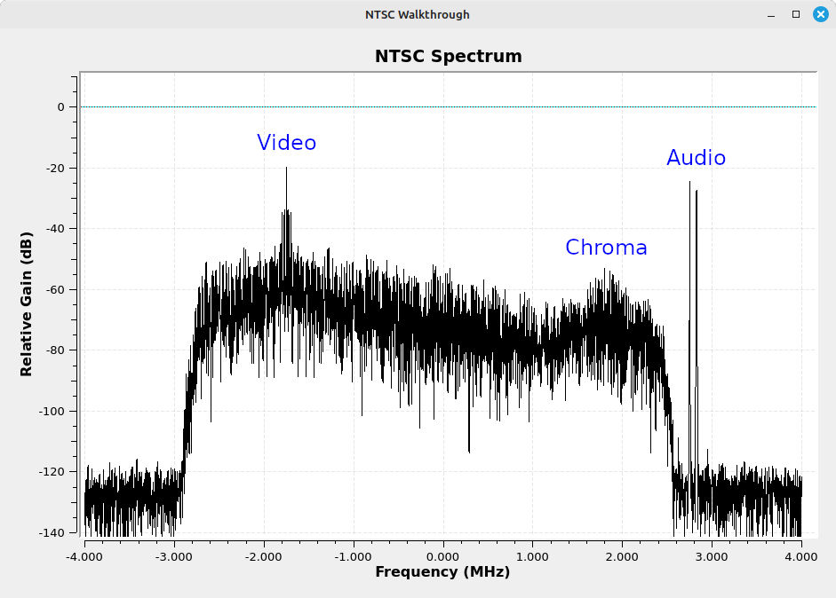
  <figcaption align="justify"><b>FigureX</b>:  Spectrum of the NTSC signal, with the relevant subcarriers labeled. 
    </figcaption>
</figure>

### Audio 

<p align="justify">
We'll start with the easier signal, the audio. NTSC audio is analog frequency modulation (FM) on a main carrier that is 4.5 MHz higher in frequency than the video carrier. NTSC allows for multiple audio carriers, with the main for the normal audio, and additional ones for secondary audio programming (SAP) and other uses. The spectrum shows what appears to be two audio carriers.
</p>

<p align="justify">
Let's put together a flowgraph that will tune to, filter and demodulate these audio carriers. Since we're not centered on the video carrier, we need to determine how much of a frequency shift to use to center the two audio signals. We can use the spectrum and a mouse cursor to determine this. The first audio carrier is 2.75 MHz from the center. We can use the following flowgraph:
</p>

<figure>
  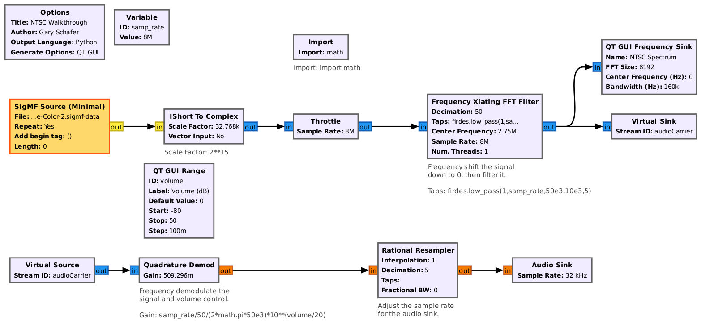
  <figcaption align="justify"><b>FigureX</b>:  Flowgraph to recover the main audio carrier from the NTSC signal. This time, I used the "Frequency Xlating FFT Filter" to shift and filter the audio carrier.
    </figcaption>
</figure>

<p align="justify">
The flowgraph above will recover the audio from the main carrier, which is flag 2. Shifting the center frequency in the "Frequency Xlating FFT Filter" to 2.829 MHz, the center frequency of the other audio carrier and the carrier used for Secondary Audio Programming (SAP), gives you a clue for solving flag 1, which is on the video signal. <!--That clue is, "The clue for the video signal is Viginere, with the key consisting of five letters that represent the name of this conference combined with the day of the week that is the last day of the conference, all lowercase and all one word." -->
</p>

### Video

<p align="jusitfy">
Now for the fun part, going after the video signal. NTSC video is modulated onto the carrier using a form of amplitude modulation (AM) known as "vestigial sideband" or "VSB" modulation. In this modulation, the upperside is left intact, and the lower sideband is filtered to remove most of the higher frequencies, leaving only a portion or "vestige" (hence the name) of the lower sideband. Regardless, it's full carrier, meaning it can be demodulated with noncoherent methods. The video carrier is centered at -1.75 MHz. But due to the AM full carrier modulation, we can simply filter the video signal, then run it through a "Complex to Mag" block to extract the baseband video. From there, we need to ensure the clock rate is set for the appropriate video format. Here's the full flowgraph for analog video. NOTE: This flowgraph will work with NTSC, PAL, or SECAM. You only need to adjust certain parameters within the flowgraph before running it.
</p>

<figure>
  
  <figcaption align="justify"><b>FigureX</b>:  Full flowgraph for demodulating and rastering the NTSC video signal. Since the video is modulated using full carrier AM, its only necessary to filter the video signal, then use the "Complex to Mag" block to extract the baseband video signal. The video signal is adjusted to create a sample rate that is easier to handle for the specific analog video type (NTSC uses sample rates that are multiples of 4.5 MHz; PAL and SECAM uses multiples of 2 MHz.) Further, depending on the video signal, the horizontal line rate will need to be adjusted. This is due to the differences in frequency of the oscillators between the transmitter and receiver. This is the purpose of the Polyphase Arbitrary Resampler, both to set to a sample rate based on the video type and also to adjust the horizontal rate to stop any scrolling. The video signal needs to be adjusted for brightness (shifting the center of the signal up / down in amplitude) and contrast (adjusting the scale of the amplitude). A Delay block provides for shifting the entire display up / down and left / right. The final Delay and Stream Mux blocks provide for interlacing of the video.
    </figcaption>
</figure>

<p align="justify">
Running this flowgraph, adjusting various parameters as described above, we get: 
</p>

<figure>
  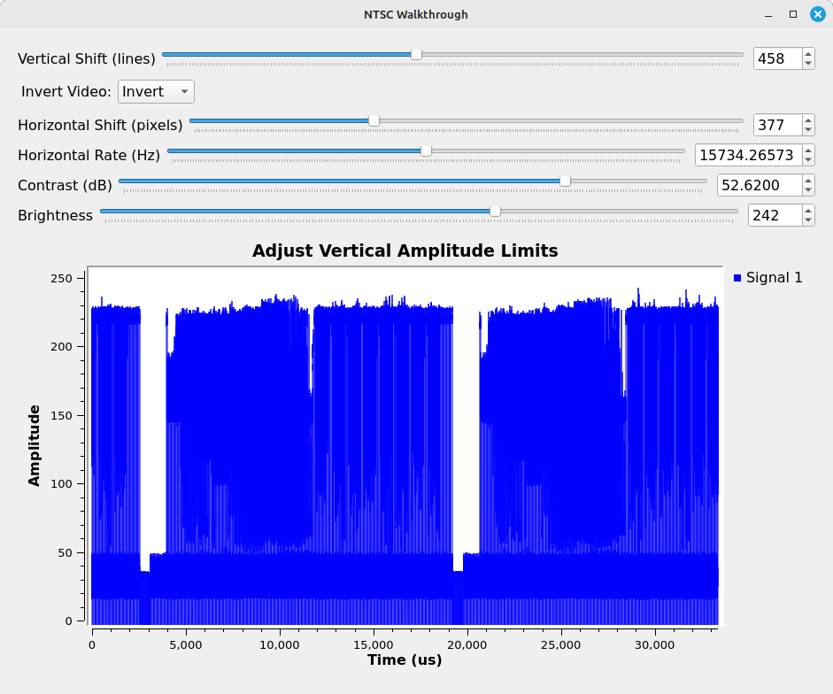
  <figcaption align="justify"><b>FigureX</b>:  Control console for the NTSC video display. When the flowgraph is first run, the video signal is quite small (less than 1), but needs to be increased so that it fills the values between 0 - 255, as this is what the Video SDL Sink wants. Further, NTSC video uses "negative polarity" on the carrier, meaning that the video, when displayed this way, will be inverted. The "Invert" option here will shift the entire display from positive to negative, hence the need for a large shift using the "Brightness" adjustment.
    </figcaption>
</figure>

<p align="justify">
Properly adjusting the parameters, leads to: 
</p>

<figure>
  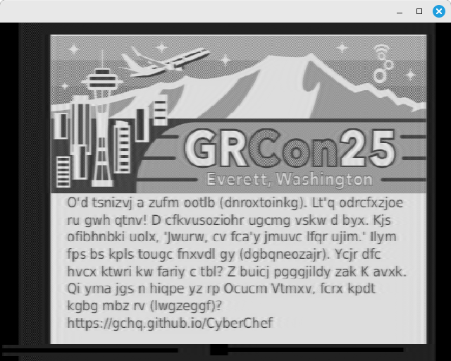
  <figcaption align="justify"><b>FigureX</b>:  Display of NTSC video using GNURadio and the flowgraph above. The video showed up offset both horizontally and vertically, so the requisite controls were adjusted to center the display. Also, this is using "invert" video so that the grayscale is the original.
    </figcaption>
</figure>

<p align="justify">
From here, the previous clue provided in the SAP (Secondary Audio Programming) signal and the hyperlink provided at the bottom of the video display need to be used. The clue says that the display is encrypted with Viginere. Opening up the URL provided (https://gchq.github.io/Cyberchef), we can use the clue from the audio streams to decode the encrypted text. 
</p>

## Please Ask Later

<p align="justify">
"Please Ask Later" is a play on the abbreviation for PAL, or Phase Alternating Line, aka "Peace At Last". PAL is a form of analog modulation that was used in most western European countries until digital television replaced it. From a general viewpoint, it has many of the same characteristics as NTSC, but some key things are different. This includes the timing, the overall bandwidth, and spacing between video, audio, and chroma. We're going to reuse the same flowgraphs as with NTSC, but will have to adjust some of the parameters. Just as we did with NTSC, we'll go after the audio first.
</p>

### Audio

<figure>
  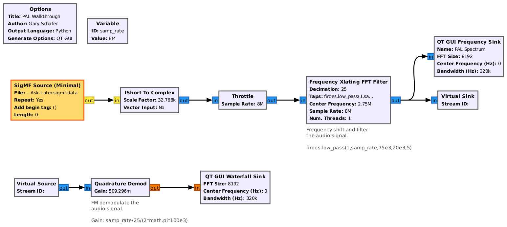
  <figcaption align="justify"><b>FigureX</b>:  Flowgraph to recover the audio from the PAL signal. Initially, the audio sounds strange, so I've put the audio into a waterfall display to see if it will tell us what is going on.
    </figcaption>
</figure>

<figure>
  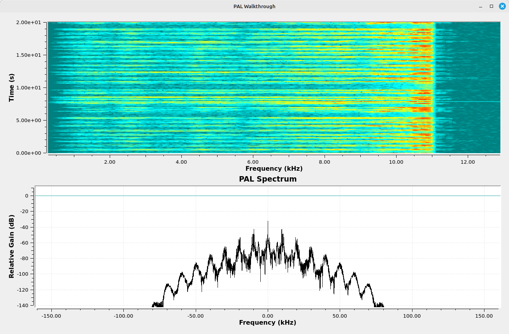
  <figcaption align="justify"><b>FigureX</b>:  Spectrogram (top, aka "waterfall") of the audio output of the audio carrier, and spectrum of FM audio carrier (bottom). The waterfall shows that the energy is concentrated at the high end of the spectrum, as if the spectrum has been inverted.
    </figcaption>
</figure>

<p align="justify">
Listening to the audio initially, it sounds wrong. Using a "Waterfall" sink, it shows that the audio energy is concentrated around 11 kHz. It's as if the spectrum has been inverted. We'll adjust the flowgraph to account for this and make the audio sound correct and we will hear the flag.
</p>

<figure>
  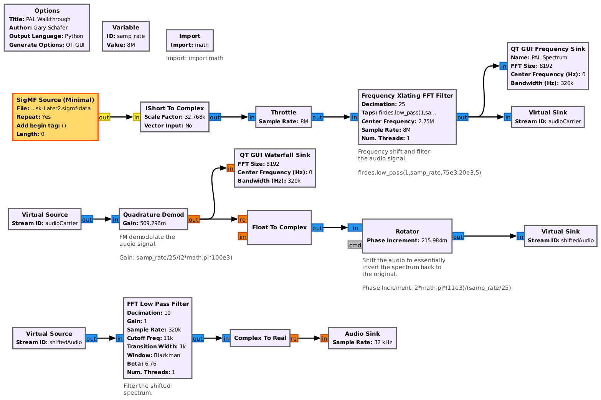
  <figcaption align="justify"><b>FigureX</b>:  Flowgraph to tune, filter, demodulate, and spectrally-invert the audio for the PAL audio carrier.
    </figcaption>
</figure>

### Video

<p align="justify">
For the video portion, I'm going to use the same flowgraph as with the NTSC video, but I'm going to change the necessary parameters. Those parameters are:
- The variables "clockDiv", "videoRate", and "numLines".
- The input file (obviously) to change from the NTSC IQ file to the PAL IQ file.
- The low and high frequencies of the FFT filter.
The final flowgraph is below:
</p>

<figure>
  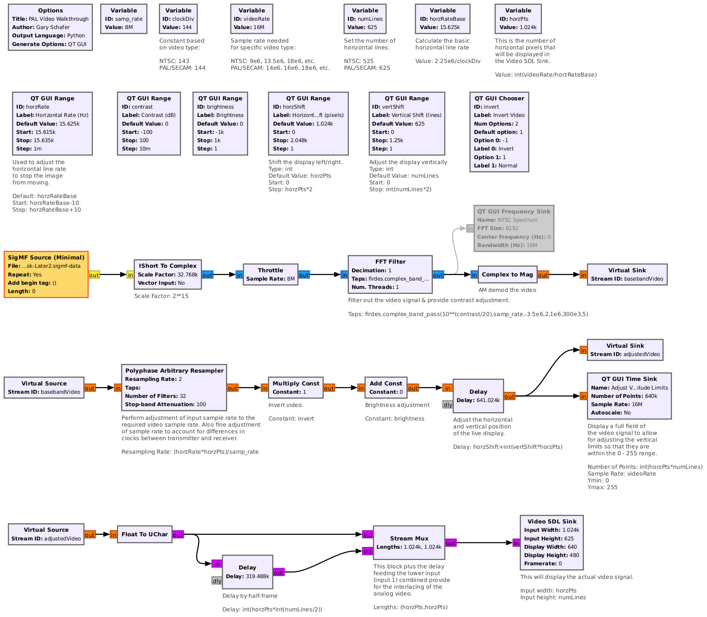
  <figcaption align="justify"><b>FigureX</b>:  Flowgraph to tune, filter, demodulate, and spectrally-invert the audio for the PAL audio carrier.
    </figcaption>
</figure>

<p align="justify">
The display shows what appears to be Morse code. Again, using the URL at the bottom, the "From Morse Code" decode block, and typing in the first, three lines of Morse code, we get the following:
</p>

<figure>
  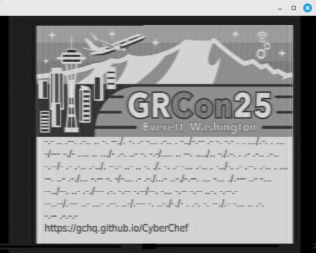
  <figcaption align="justify"><b>FigureX</b>:  Display of the video from the PAL signal.
    </figcaption>
</figure>

Decoding the Morse Code leads to some unintelligible text, but the free hint was "The first displayed letters are KEY." If you take the first letters of the output box above, they spell out "key rot thirteen", as in "key ROT13". Translating the remaining Morse code, you get several words which appear like gibberish. Adding in the ROT13 block, the final text (including the flag) appears.

## Signal Identification

This challenge consisted of two parts, both containing common RF signals used in the amateur radio band. 

### Part 1 (@livethisdream)

This is a 960kHz spectrum consisting of four signals and five flags. 

<figure>
  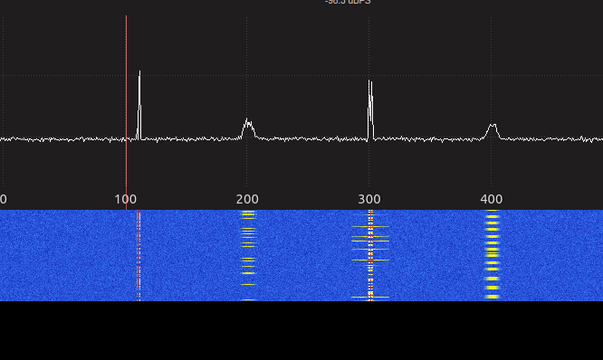
  <figcaption align="justify"><b>FigureX</b>:  The overall spectrum of part 1 of the signal identification challenge.
    </figcaption>
</figure>

The signals are, from left to right: CW, APRS, DTMF, and M-17 (voice and text).

#### CW
This is USB modulated morse code, which we can demodulate using a number of techniques. My favorite comes from the [GQRX blog](https://www.gqrx.dk/doc/streaming-audio-over-udp), and uses GQRX to filter and demodulate the signal, then streams the baseband samples to multimon-ng using UDP.  We simply enusre the UDP button is active in the baseband signal window on the bottom right of GQRX and set the port to 7355. Then, the one line bash command is:

```
nc -l -u 7355 | sox -t raw -esigned-integer -b16 -r 48000 - -esigned-integer -b16 -r 22050 -t raw - | multimon-ng -t raw -a SCOPE -a MORSE_CW -
```

<figure>
  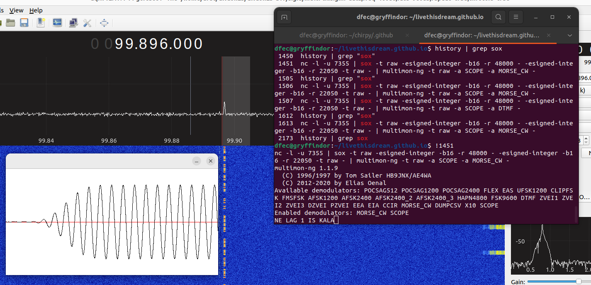
  <figcaption align="justify"><b>FigureX</b>:  The windows showing GQRX USB demodulated samples streamed over UDP to multimon-ng, which displays the scope view of the samples and decodes the morse code. 
    </figcaption>
</figure>

#### APRS

The second signal from the left is APRS, which uses AFSK1200 and can be decoded using a NBFM decoder combined with the built-in AFSK1200 decoder in GQRX:

<figure>
  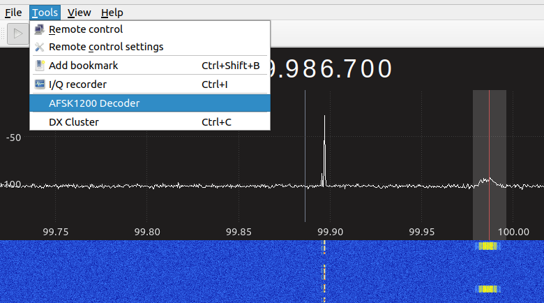
  <figcaption align="justify"><b>FigureX</b>:  The AFSK1200 decoder in GQRX combined with a NBFM tuner. 
    </figcaption>
</figure>

We may also use direwolf in the terminal by intercepting the UDP packets. The command is:

```
direwolf -r 48000 udp:7355
```

#### DTMF
The third signal from the left is DTMF (old-school cool). The flag is the numerical key sequence. As with CW and APRS, we can use USB or LSB demodulator to stream the samples to multimon-ng:

```
nc -l -u 7355 | sox -t raw -esigned-integer -b16 -r 48000 - -esigned-integer -b16 -r 22050 -t raw - | multimon-ng -t raw -a SCOPE -a DTMF -
```

<figure>
  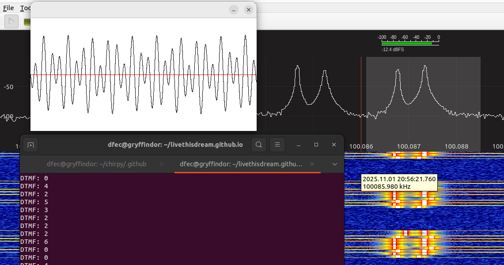
  <figcaption align="justify"><b>FigureX</b>:  Multimon-ng decodes DTMF receiving UDP packets from a USB or LSB decoder in GQRX. 
    </figcaption>
</figure>

#### M-17

The signal on the far right is [M-17](https://m17project.org/), which can be decoded in GNURadio or SDRAngel. I prefer SDRAngel for its simplicity. The signal contains two flags: one voice and one text (SMS). To find the voice text, we expand the RF bandwidth to about 16kHz, reduce the squelch threshold, and reduce the volume of the output (I found 0.1 to be a good value). Note, when using Ubuntu, I found SDRAngel's M-17 plugin often crashes. The best approach to avoid a crash is to set all the values before playing the file back, then starting the file playback and moving the tuner to capture the signal. It's suboptimal, but I have experienced the bug for the last several years, only on Ubuntu. 

<figure>
  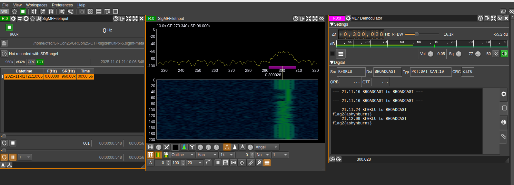
  <figcaption align="justify"><b>FigureX</b>: Decoding the M-17 signal in SDRAngel. 
    </figcaption>
</figure>

### Part 2 (@jesternofool)
<p align="justify">
This is a 1 MHz spectrum consisting of six (6) signals total.
</p>

<figure>
  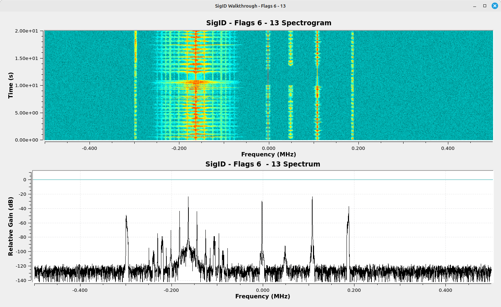
  <figcaption align="justify"><b>FigureX</b>: Spectrum of Signal Identification for Flags 6  - 13. These were all analog modulation schemes. From left to right, the signals were AM-USB-SC, wideband FM (mimicking a US FM broadcast station), AM-DSB-FC, AM-DSB-SC, narrowband FM, and AM-LSB-SC.</figcaption>
</figure>

#### AM-LSB

<p align="justify" markdown="1">

Working from left to right in this spectrum, the first signal is an amplitude modulated (AM) single sideband using the upper sideband (USB) and with a suppressed carrier (SC). Its center frequency (the frequency where the carrier would be if it were not suppressed) is at roughly -300 kHz. The modulation can be determined based on the waterfall. The spectrogram shows a signal that has energy that is concentrated on the lower portion of the spectrum. This is indicative of AM-USB. And since there's no consistent line on the left side, it's a suppressed carrier.[^fna]

</p>


<figure>
  
  <figcaption align="justify"><b>FigureX</b>: Spectrogram of the signal centered at roughly -300 kHz in the Signal ID challenge for flags 6 - 13. Note how the energy is concentrated on the lower frequency edge of the signal. This and the pattern (it's similar to the patten for speech) indicates an AM-LSB audio signal. And as there is no consistent line anywhere in the signal, it is also suppressed carrier.</figcaption>
</figure>

<p align="justify">
This signal can be recovered using the AM-LSB demodulator of GQRX, or using the following GNURadio flowgraph:
</p>

<figure>
  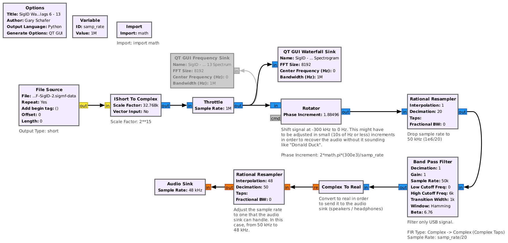
  <figcaption align="justify"><b>FigureX</b>: Flowgraph to recover the LSB signal centered at -300 kHz. The result is an audio signal containing the flag.</figcaption>
</figure>

<p align="justify">
Note, the "Rotator", "Rational Resampler", and "Band Pass Filter" could easily be replaced with a "Frequency Xlating FIR Filter" block, which performs the shift, filter, decimate functions (in that order). 
</p>

#### Wideband FM (WBFM)

<p align="justify">
The next signal over, centered at roughly -163 kHz, is a higher bandwidth signal. A basic noise-noise bandwidth measurement shows it to be roughly 200 kHz wide. The spectrum shows a signal that appears to shift from side to side, indicative of frequency modulation. Further, filtering the signal and inputting it into a QT GUI Constellation Sink shows a clear ring, also indicative of frequency modulation.
</p>

<div class="row">
    <div class="column" style="width:100%">
        <figure>
          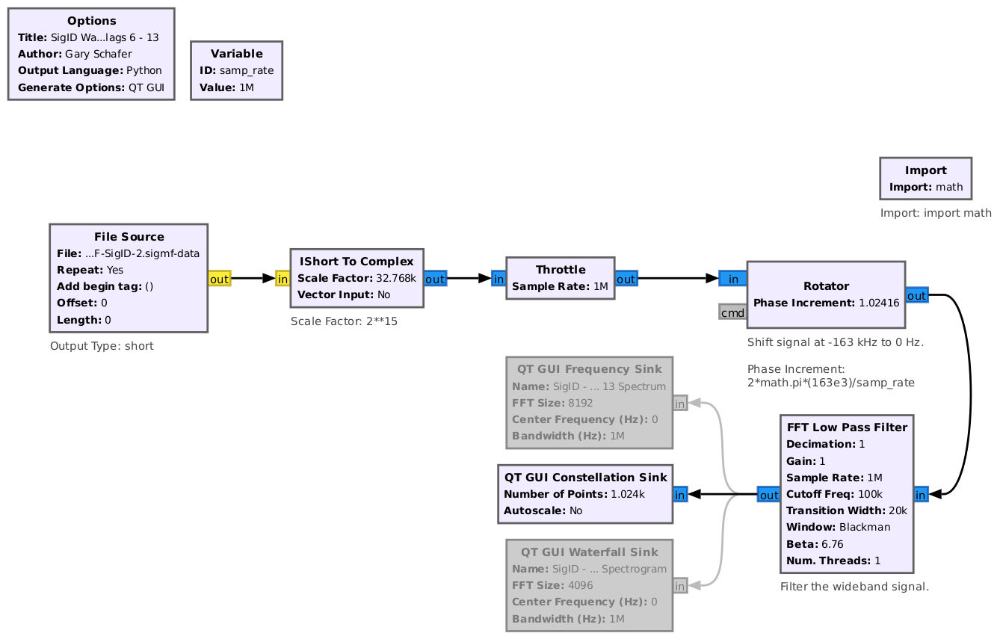
          <figcaption align="justify"><b>FigureX</b>: Flowgraph for determining the modulation of the wideband signal at -163 kHz. The filtered signal feeds into a QT GUI Constellation Sink.
        </figcaption>
        </figure>
    </div>
    <div class="column" style="width:100%">
        <figure>
          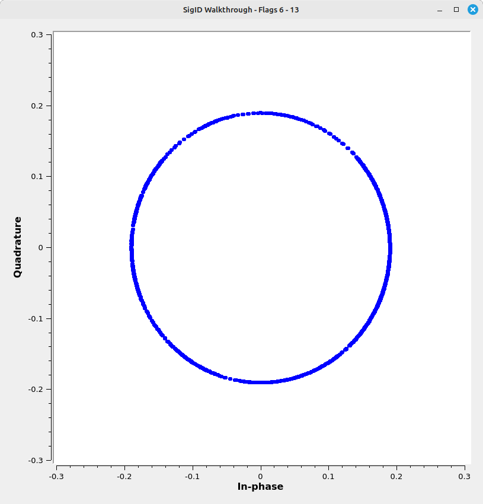
          <figcaption align="justify"><b>FigureX</b>: The output of the constellation sink. The result is a signal whose phase is constantly changing, but whose amplitude (distance from the center of the display) is fixed. This constant envelope and variable phase appearance indicates frequency modulation (FM).
        </figcaption>
        </figure>
    </div>
</div>    

<p align="justify">
As with AM signals, GQRX can readily demodulate the FM signal to baseband audio; it can also decode the RDS signal by turning on "View -> RDS" and selecting the "Enable RDS" from the RDS tab in the bottom right.  
</p>

<figure>
  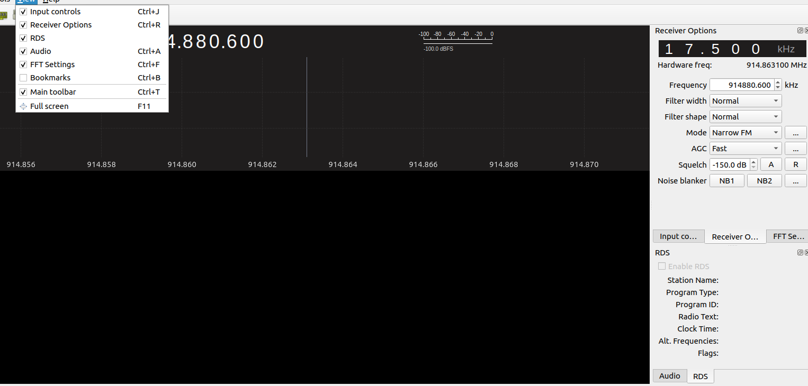
  <figcaption align="justify"><b>FigureX</b>:  The GQRX menus for turning on RDBS decoding. 
</figcaption>
</figure>

<p align="justify">
There are also several options for frequency demodulating this signal in GNURadio. These include the WBFM Receive, the WBFM Receive PLL, and the FM Demod. However, all of these tend to limit the amount of baseband spectrum available. Since we do not have an idea of what all the baseband spectrum will provide, we're going to use the Quadrature Demod block. This is just a basic frequency demodulator without anything else (as all of those other blocks provide).
</p>

<figure>
  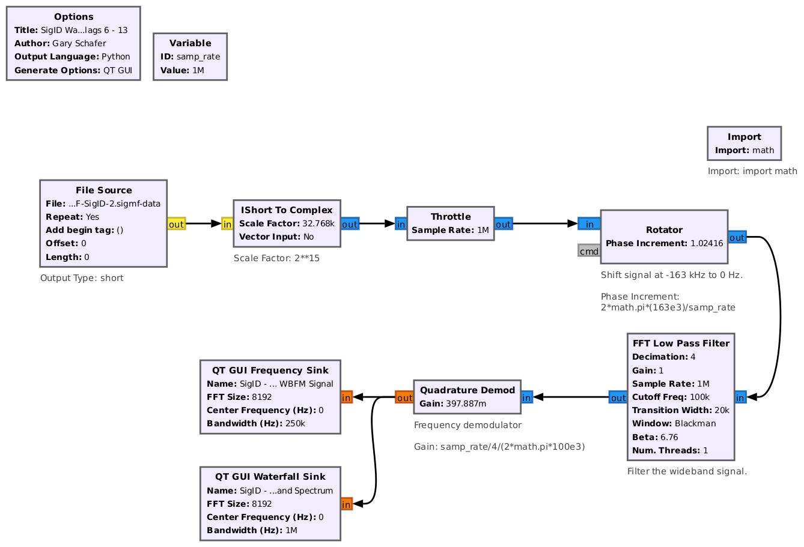
  <figcaption align="justify"><b>FigureX</b>: Flowgraph to frequency demodulate the WBFM signal. Rather than using the WBFM Receive, FM Demod, or WBFM Receive PLL blocks (which would limit the output spectrum), I'm using the basic frequency demodulator block, the Quadrature Demod block.
</figcaption>
</figure>

<p align="justify">
The output from this flowgraph shows a baseband spectrum with several signals.
</p>

<figure>
  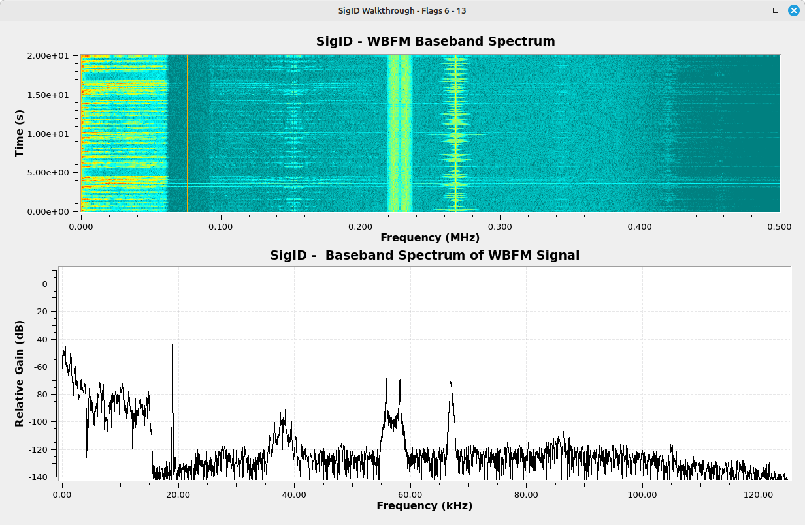
  <figcaption align="justify"><b>FigureX</b>:  Baseband spectrum of the WBFM signal. This spectrum shows a composite of several signals. This is identical to standard FM broadcast stations. Starting from 0 Hz, the signal from 0 - 15 kHz is an audio signal comprised of the left and right stereo signals added together, a 19 kHz sinusoid that is used to recover the next signal up, a 38 kHz AM-DSB-SC stereo signal comprised of the left and right signals with the right subtracted from the left, a 57 kHz Radio Data System (RDS) signal, and a Subsidiary Communications Authority (SCA) signal at 67 kHz. All the signals starting with the 19 kHz pilot signal are technically called "subcarriers", and provide different information.
</figcaption>
</figure>

<p align="justify">
Starting with the baseband audio (called the "L+R" audio, typically), we can use a Rational Resampler and Audio Sink to recover that audio. This provides Flag 6.
</p>

<figure>
  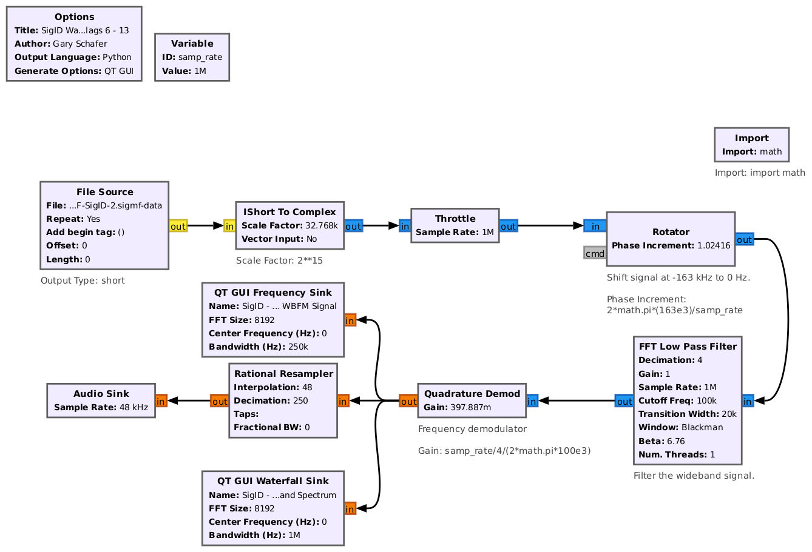
  <figcaption align="justify"><b>FigureX</b>: Flowgraph to recover the baseband (L+R) audio from the WBFM signal. This will recover Flag 6.
</figcaption>
</figure>

<p align="justify">
The next signal in the demodulated FM spectrum is the pilot tone. If you look at both the spectrum and spectrogram, you see that it does not vary in either amplitude or frequency. Hence, it can be ignored. The 38 kHz signal is typically called the "stereo" signal. Combined with the baseband, this signal provides individual left and right audio for stereo receivers. You can either create a flowgraph to use the pilot tone to demodulate this stereo signal (as is done in any stereo receiver), or you can just create a flowgraph to recover this signal without the pilot tone. That's what we'll do here.
</p>

<figure>
  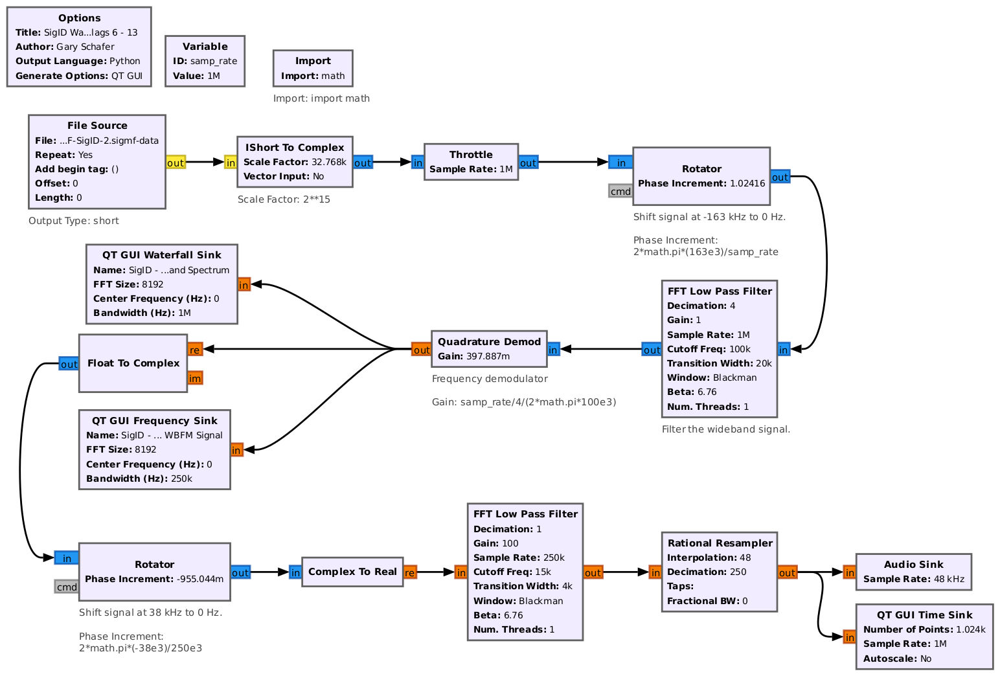
  <figcaption align="justify"><b>FigureX</b>: Flowgraph to recover the 38 kHz stereo subcarrier from the WBFM signal. For this specific signal, the recovery will be almost perfect, if not perfect. In the case of a stereo signal from an actual FM broadcast station, the recovery will be varying amplitude levels.
</figcaption>
</figure>

<p align="justify">
Listening to this signal, you'll find that it has the exact, same information as the baseband (L+R) signal. 
</p>

<p align="justify" markdown="1">
The next signal higher in the baseband spectrum is the Radio Data System (RDS), and is called the Radio Broadcast Data System (RBDS) in the US. It's a low data rate digitally-modulated subcarrier. It has a raw bit rate of 1187.5 bits/sec. This is derived from a 57 kHz clock that is decimated by 48. It is both differentially then Manchester encoded. The Manchester encoding effectively doubles the symbol rate of the carrier (2375 Hz). The output symbols are filtered using a root raised cosine (RRC) filter, the modulated onto the carrier using binary phase shift keying (BPSK). A flowgraph to extract this signal essentially does all of this in reverse.[^fnb]
</p>


<figure>
  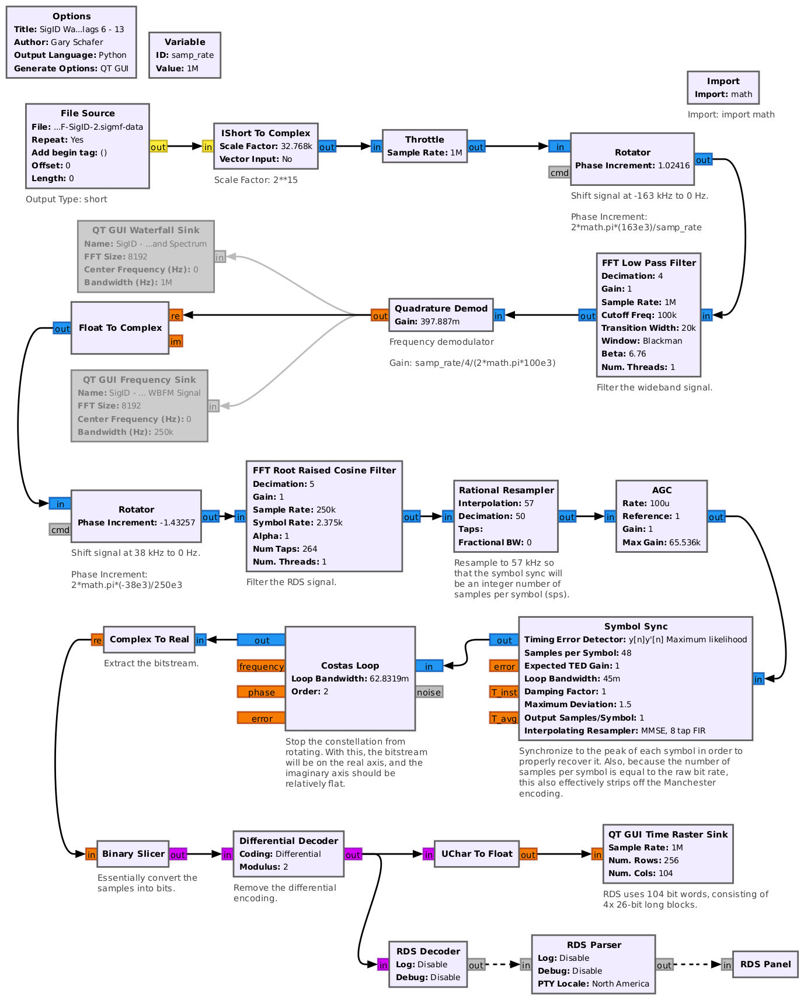
  <figcaption align="justify"><b>FigureX</b>: Flowgraph to demodulate and decode the RDS signal on the WBFM baseband.
</figcaption>
</figure>

<p align="justify">
 Running this flowgraph, we get the following bit raster, showing Flag 7. 
</p>

<figure>
  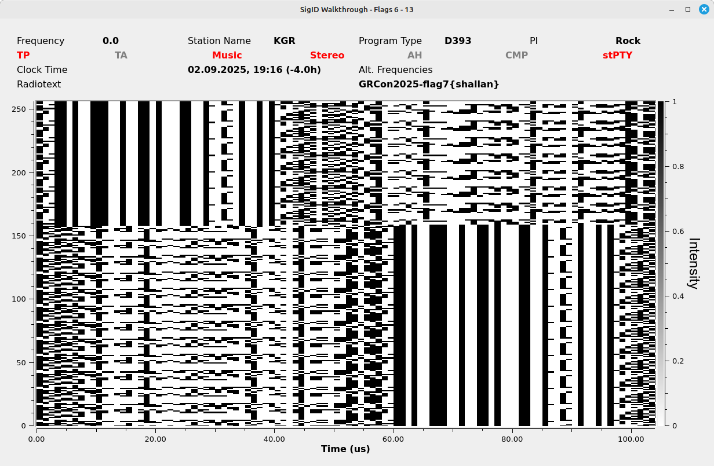
  <figcaption align="justify"><b>FigureX</b>: RDS readout and time raster of the bit stream synchronized to the 104-bit word length. The shift roughly halfway down the time raster is due to the signal file starting to repeat.
</figcaption>
</figure>

<p align="justify">
The last subcarrier in the FM signal is centered at 67 kHz. It is a Subsidiary Communications Authority (SCA) signal, which is NBFM. Using the following flowgraph, we can recover the last flag on this signal.
</p>


<figure>
  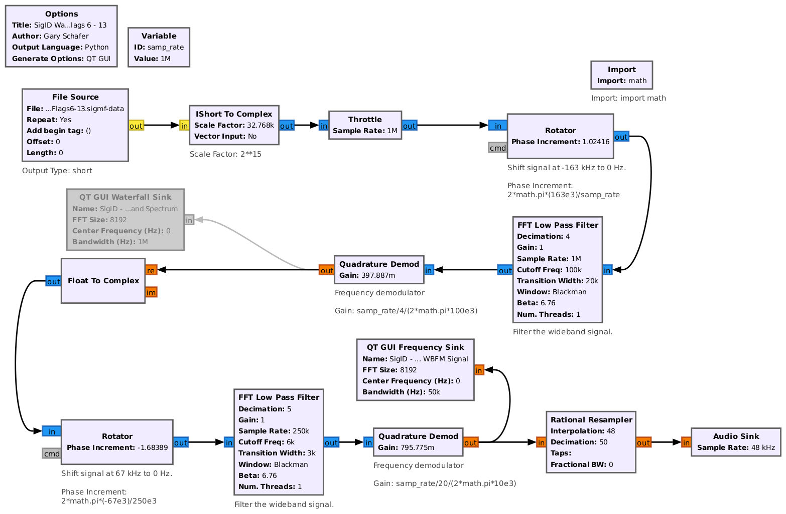
  <figcaption align="justify"><b>FigureX</b>: Flowgraph to recover the SCA on the WBFM signal. The result is audio reading flag 8. 
</figcaption>
</figure>

<p align="justify">
This completes the WBFM signal. 
</p>

#### AM DSB-FC (Double Sideband-Full Carrier)

<p align="justify">
The next signal higher in the spectrum is centered at approximately -2 kHz. Looking at the spectral displays (spectral trace and spectrogram), you notice that the signal appears to have upper and lower sidebands, as well as a consistent amplitude spectral line in the center.
</p>

<figure>
  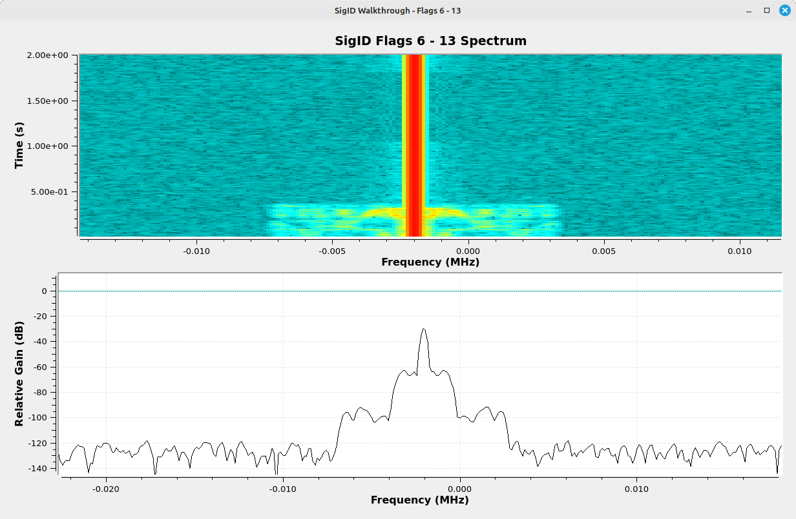
  <figcaption align="justify"><b>FigureX</b>: Spectrogram (top) and spectral trace (bottom) of the signal centered at ~ -2 kHz. The spectrogram and spectral trace show upper and lower sidebands that are varying up / down, indicating amplitude modulation (AM). They are also symmetrical (mirror images of each other), indicating double sideband. The consistent amplitude spectral line in the center indicates full carrier. So, this is a AM-DSB-FC signal.
</figcaption>
</figure>

<p align="justify">
We could use GQRX's built-in AM demodulator to recover the audio, but using GNURadio is instructional.Because this is a full carrier (the consistent amplitude spectral line at the center of the signal), we can use a straightforward noncoherent demodulator on this signal (envelope detection). This is just a "Complex to Mag" block.
</p>

<figure>
  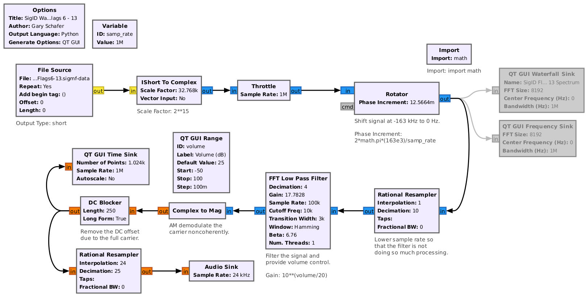
  <figcaption align="justify"><b>FigureX</b>: Flowgraph to tune to and demodulate the signal centered at ~ -2 kHz of the SigID spectrum for flags 6 - 13. This was a AM-DSB-FC signal, meaning it could be demodulated using a "Complex to Mag" block. The result is an audio stream reading the flag.
</figcaption>
</figure>


#### AM DSB-SC (Double Sideband Suppressed Carrier)

<p align="justify">
The next signal is centered at roughly 48.5 kHz and is shown below. The signal appears to have symmetry, with an 
upper and lower sideband. The sidebands appear to vary up / down, indicating AM. The mirror-imagery between the upper and lower sidebands indicate double sideband (DSB). However, there's no consistent spectral line, indicating suppressed carrier (SC). This is a AM-DSB-SC signal.
</p>

<figure>
  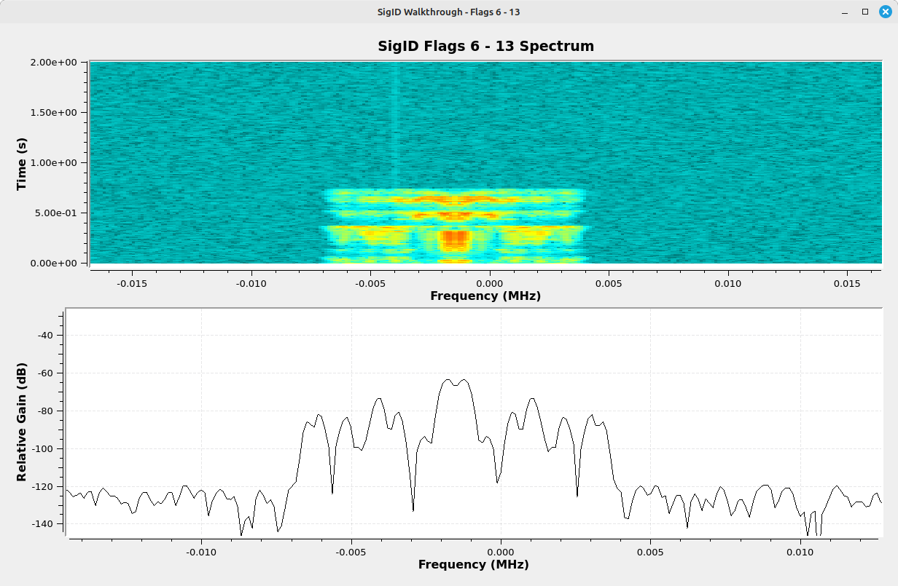
  <figcaption align="justify"><b>FigureX</b>: Spectrum of the signal centered at ~48.5 kHz. 
</figcaption>
</figure>

<p align="justify">
We could use GQRX's built-in AM demodulator to recover the audio, but using GNURadio is instructional. Due to the fact that this is a DSB-SC signal, we cannot use noncoherent methods ("Complex to Mag", or similar) to demodulate it. In this case, we'll use a "Costas Loop" block to sync to the phase of the signal for demodulation. The filtered signal is also amplified (the gain setting in the filter), and passed through the Costas Loop to synchronize to the phase of the signal. The sync will lock the signal phase to the real axis, so extracting the real signal from the complex ("Real to Complex" block) extracts the audio.
</p>

<figure>
  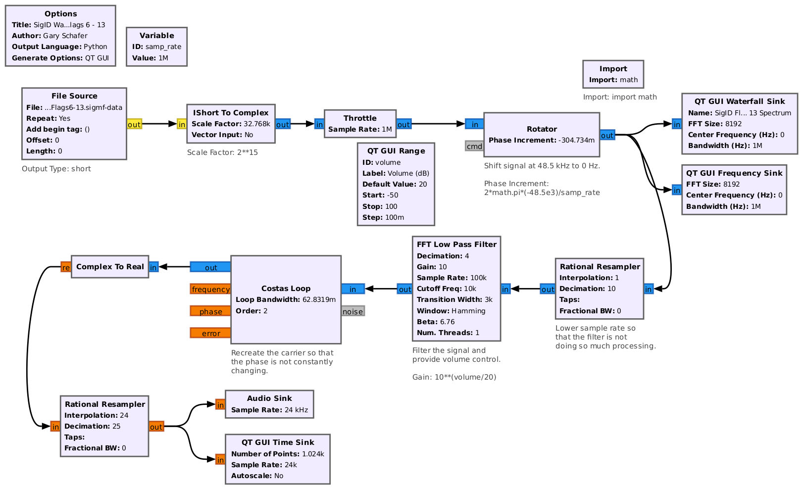
  <figcaption align="justify"><b>FigureX</b>: Flowgraph to demodulate the signal centered at ~48.5 kHz. The signal is AM-DSB-SC. 
</figcaption>
</figure>


#### NBFM (Narrowband FM)

<p align="justify">
The next signal is centered at ~108 kHz. The signal, at first glance, appears similar to the AM-DSB-FC signal. However, when the signal reaches its peak, the spectrum is not symmetric, and the peak at the center disappears. This indicates FM, specifically narrowband FM (NBFM).
</p>

<figure>
  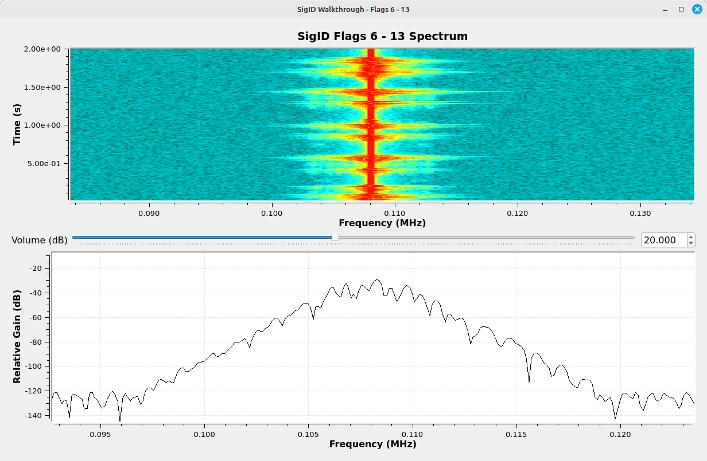
  <figcaption align="justify"><b>FigureX</b>: Spectrum of signal centered at ~108 kHz.
</figcaption>
</figure>

<p align="justify">
We can either use GQRX or GNURadio's NBFM Receive block or Quadrature Demod with a narrowband filter -- for the sake of granularity, we will use the latter. The result is a baseband audio reading the flag.
</p>

<figure>
  
  <figcaption align="justify"><b>FigureX</b>: GNURadio flowgraph for demodulating the NBFM signal.
</figcaption>
</figure>

#### AM-SSB (LSB)

<p align="justify">
The last signal in this spectrum is centered at roughly 189 kHz:
</p>

<figure>
  
  <figcaption align="justify"><b>FigureX</b>: Spectrum of signal centered at ~189 kHz. 
</figcaption>
</figure>

<p align="justify">
The spectrum is similar to the lowest frequency signal in the spectrum, which was AM-USB-SC. The difference is that this signal appears to be a mirror image of that signal. That's because this signal is AM-LSB-SC. This can be seen from the fact that its spectrum does not appear to be symmetrical. The energy is stronger on the higher frequency portion of the signal, and the signal varies amplitude, indicating single sideband (SSB) AM, and specifically LSB-AM.
</p>

<p align="justify">
Again, we have options (GQRX, GNURadio), and we build the following GNURadio flowgraph, which produces baseband audio dictating the flag.
</p>

<figure>
  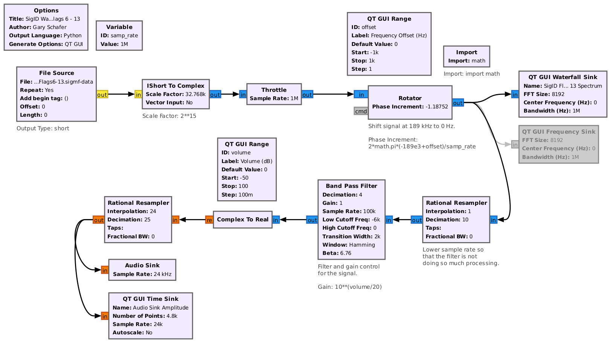
  <figcaption align="justify"><b>FigureX</b>: Flowgraph to demodulate the AM LSB signal 
</figcaption>
</figure>

#### Signal Identification Final Comments

<p align="justify">
For many of these challenges, we combined a number of signals generated from separate flowgraphs or data sources. In this case, we generated individual [sigmf](https://sigmf.org/) files, then resampled and combined the files in GNURadio. For example, we may generate a NBFM signal at 48ksps, but would be required to upsample the file to 1Msps for the overall spectrum. This takes some finesse, as the individual files may contain different numbers of IQ samples -- the head block is set to allow the "longest" file to play. Additionally, we want to shift each signal to a unique portion of the spectrum. This is commonly referred to as Freqeuncy Division Multiplexing and we are using the "Frequency Shift" block (as opposed to the "Rotator" block) for this shift. 
</p>

<figure>
  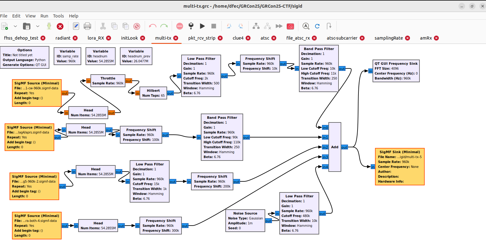
  <figcaption align="justify"><b>FigureX</b>: Flowgraph to resample and combine several signals into a final broadband signal. 
</figcaption>
</figure>

<br>

## Radiant

<figure>
  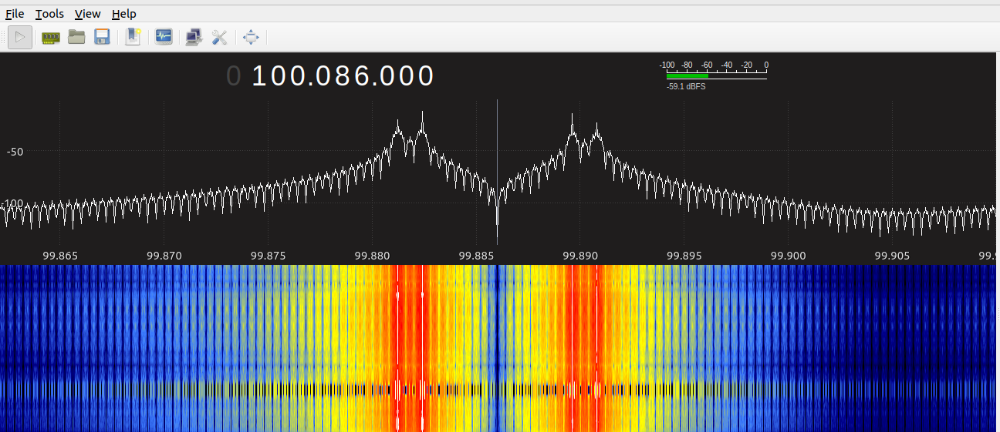
  <figcaption align="justify"><b>FigureX</b>: The spectrum of the radiant challenge. 
</figcaption>
</figure>

This challenge was inspired by the first assignment I gave my students in their applied SDR class. It breaks a file (really, any file will work) into bytes, then bits, and FSK modulates those bits. I don't include any error correction or noise, which should make the demodulation and decoding fairly straightforward, using the [FSK tutorial](https://wiki.gnuradio.org/index.php/Simulation_example:_FSK) on GNURadio's wiki. 

The first flag is the modulation type, which is 2FSK. 

To find the other flags, we need to demodulate the signal and find the image referenced in the clue. 

In our case, we need to determine the baud rate and samples per symbol. Using the FFT or the waterfall plot, we measure the two frequencies as 1800Hz and 2400Hz, making the frequency deviation 600Hz.   Then, using a quadrature demod, we can measure the bitlength:

<figure>
  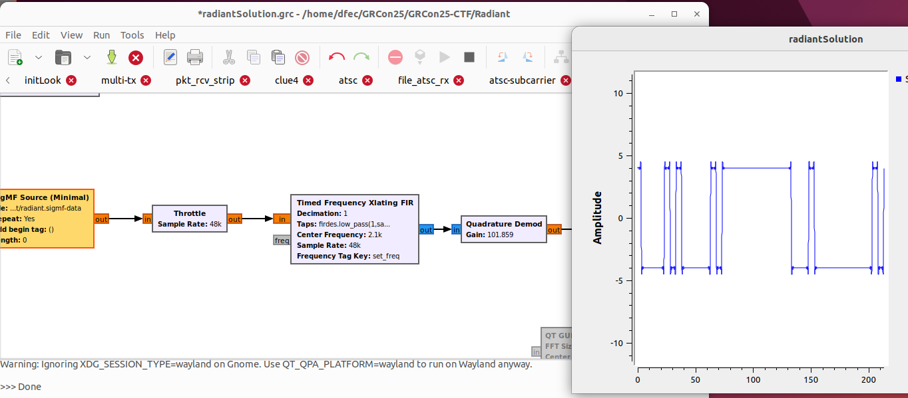
  <figcaption align="justify"><b>FigureX</b>: Results of the quadrature demod.
</figcaption>
</figure>

Zooming in on what appears to be a single bit, we can measure this as 5ms, which makes the baud rate 200bps. Given a sample rate of 48kHz, we calculate the samples per symbol at 240. 

<figure>
  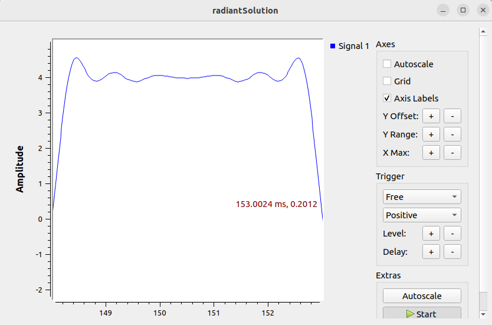
  <figcaption align="justify"><b>FigureX</b>: Measuring the bitlength by zooming in on a single bit. The time on the right is 153ms, while the time on the far left is 148ms. This gives a bit length of 5ms. 
</figcaption>
</figure>

Finally, we use the binary slicer to shift the values to 0's and 1's, place a delay block to allow for bit errors at the beginning of the transmission, then decimate by 240 and pack the bits into bytes, and save the file into an image format. The final flowgraph is as follows:

<figure>
  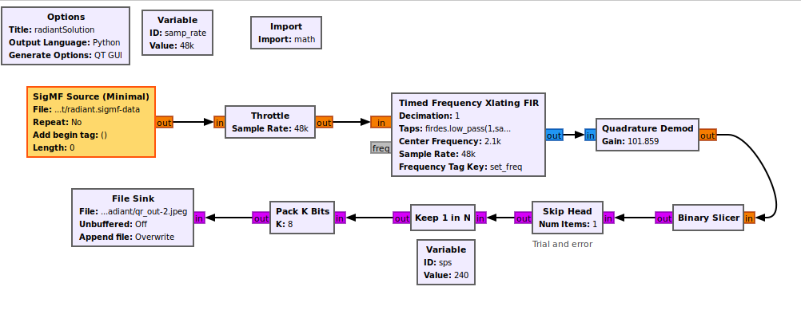
  <figcaption align="justify"><b>FigureX</b>: The final flowgraph. You will have to tinker with the skip head parameter to find the correct file length.  
</figcaption>
</figure>

The image is a QR code, which gives the second flag. 

The other two flags are embedded in the file using steganography methods. Using steghide, you can find one of the flags. Inspecting the image data as text will give the other flag in plain text. 

<br>  

## Supermurgatroid

> Coming soon
{: .prompt-info }


## Footnotes
[^fna]: The term "suppressed carrier" here is a misnomer. The carrier is not actually suppressed. There must be a carrier, otherwise, there would be nothing to modulate. What is meant here is that there is no unmodulated sinewave that acts as a reference with which we could noncoherently demodulate this signal. However, the term "suppressed carrier" has a long history, and who am I to argue with history? (steps down from soapbox)

[^fnb]: The standard states, "The subcarrier is amplitude-modulated by the shaped and biphase coded data signal (see 1.7). The subcarrier is suppressed. This method of modulation may alternatively be thought of as a form of two-phase phase-shift-keying (psk) with a phase deviation of ± 90°." (Source: NRSC-4-A, United States RBDS Standard, Specification of the radio broadcast data system (RBDS), April, 2005).
