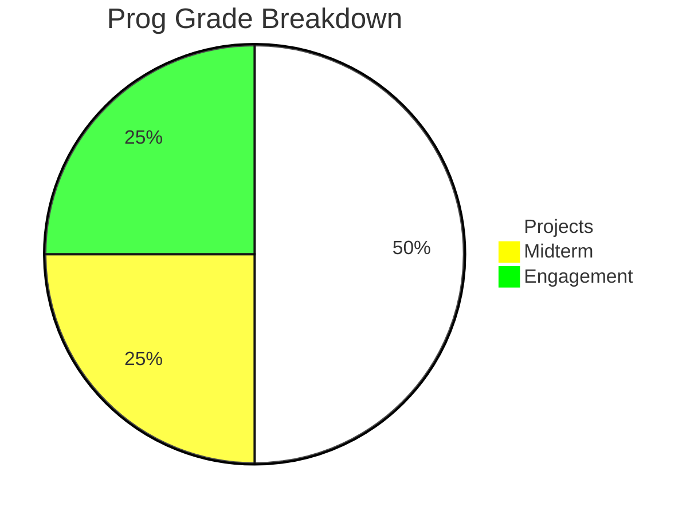
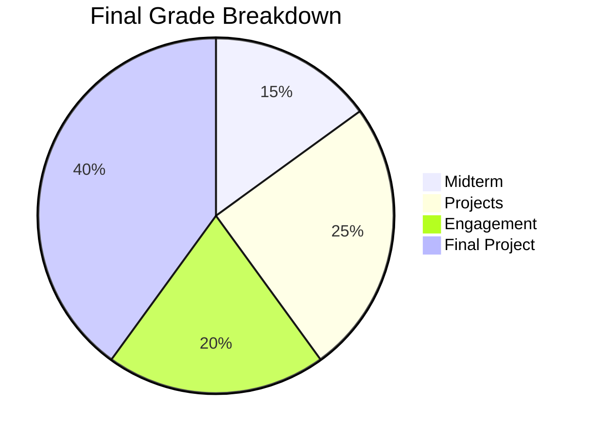

Download a PDF copy of the syllabus [here](/assets/pdf/ECE448_Syllabus_Spring%202025.pdf)

# Course Description
	
Have you ever thought about the sheer number of wireless signals surrounding you in the modern world?  From cell 
phones to WiFi to bluetooth - wireless communications enable just about everything you do! In this course, we will 
take a look at these signals -- how they're generated, transmsitted, and received!  ECE 447 Communications Theory 
covers many of the fundamental principles of many methods of communication. This course will focus on the applied 
aspects wireless communications, specifically using Software Defined Radios (SDRs). This course will introduce SDRs, 
familiarize the student with the benefits and limitations of various SDRs and the various software packages used to 
interact with them.

# Instructor
Dr. Neil Rogers (Course Director), [neil.rogers.@afacademy.edu](mailto:neil.rogers.@afacademy.edu)

Fairchild 2E38

# Goals & Objectives

Cadets enrolled in the course shall develop the ability to interact with SDRs, select the best SDR and software package for a certain application, and develop software to transmit/receive wireless signals. Cadets will also:
- Make use of modern software applications to simulate, receive, and transmit signals using modern modulation and 
encoding techniques. 
- Describe the principles of basic signal processing techniques, such as filtering, interpolation, decimation, and 
  matched filtering.  
- Implement basic signal processing techniques, such as filtering, interpolation, decimation, and matched filtering 
  in the presence of noise and other non-idealities. 

#  Prerequistes 
- **ECE 215/315:** Modulation and demodulation techniques for analog and digital systems. 
- **CompSci 206/210/211/212:** Basic programming skills.

# Text
There is no formal text, but we will make heavy use of a variety of sources, primarily:
- [PySDR](https://www.pysdr.org)
- [GNURadio Wiki](https://wiki.gnuradio.org/index.php/Tutorials)

# Grading
Grades in this course will be assigned based on a number of **projects**, a **midterm**, **engagement** in course 
material, and a **final project**.

## Assignment Descriptions

**Projects** will be assigned for each signal type, and will culminate in a formal final report. Each project report 
will clearly articulate your accomplishments in the course of each project. There is no page limit, but one page is 
typically not enough to completely describe your work. Reports should follow guidance in the [Deliverables]
(#%20Deliverables) section. 

**Engagement Credit (EC)** will be earned through weekly quizzes on Gradescope, EI, and by instructor prerogative 
(IP). IP credit will be assigned by my subjective assessment of your level of engagement.

**Midterm** is an individual effort and will consist of an in-class portion and a practical portion completed outside of 
class. 

For your **Final Project**, you will research, design, and implement a wireless communication project. You will 
produce an IEEE-quality paper as your final report and present your work to the class. Your **Final Project** is an 
extensive part of the final grade -- it should be treated as such. You **WILL NOT** succeed in this project without 
sustained, consistent effort over the semester. The final project is self-scoped and culminates in a IEEE-quality report and presentation/demonstration of your communication system.
Checkpoints for each part of the project are identified in the course schedule. Each checkpoint will be graded on a binary scale (0 or 1), with revisions accepted according to course policy. The goal of each checkpoint is to develop a section of your final report, and to indicate you are making progress towards your final goal. 

- You must first submit a **Project Proposal**, which will identify \textit{what} you want to build, *why*
you believe it is meaningful and feasible, and clearly identify your endstate for A-, B-, and C- level submissions.
- The **Background Research** will include a survey of previous work upon which you will base your project. You must 
  include at least 4 high quality sources and discuss its relationship to your project. 
- Your **Design Description** describes your initial design, including critical components and their functions, 
  use cases, test plan, and any progress made. 
- The **Prototype Description** will capture results of your design build and test, along with your plan for 
  completion of the project. 
- The **final project submission consists of a IEEE-quality report and a 5-minute project presentation/demonstration.
  No page requirement is given for the final report, but typical reports are at least 7-10 pages, including diagrams, photos, tables, etc. as necessary. The final report should completely document every aspect of the project development. Any code should be published to a github repository. 
- Your **final project presentation** must be engaging and descriptive, capturing the story of your project, including 
  information from your checkpoints and lessons learned.

## Grading Specifications:
In general, work will receive one of the following scores. Note, specifications may be 
tailored to specific assignments.

<table style="width: 100%; border-collapse: collapse;">
    <thead>
        <tr style="background-color: #d3d3d3;">
            <th style="border: 1px solid black; text-align: center;"><strong>Score</strong></th>
            <th style="border: 1px solid black; text-align: left;"><strong>Specification</strong></th>
        </tr>
    </thead>
    <tbody>
        <tr>
            <td style="border: 1px solid black; text-align: center;">1</td>
            <td style="border: 1px solid black; text-align: left;"> Problem answer meets or exceeds expectations of the assignment. Understanding of concepts is evident. There are 
no nontrivial errors. Communication (i.e. description of methodology) is clear and complete. </td>
        </tr>
        <tr>
            <td style="border: 1px solid black; text-align: center;">1</td>
            <td style="border: 1px solid black; text-align: left;"> Partial understanding of concepts is evident but significant gaps remain. Improved communication (i.e. 
description of methodology) and/or significant revisions are needed. </td>
        </tr>
        <tr>
            <td style="border: 1px solid black; text-align: center;">1</td>
            <td style="border: 1px solid black; text-align: left;"> No work provided or minimal effort on the problem.</td>
        </tr>
    </tbody>
</table>

## Grade Scale

| **Grade** | **Range** |
| A | > 93 | 
| A- | \[90, 93\) |
| B+ | \[87, 90 \) |
| B | \[84, 87 \) |
| B- | \[80, 84 \) |
| C+ | \[77, 80 \) |
| C | \[74, 77 \) |
| C- | \[70, 74 \) |
| D | \[60, 70 \) |
| F | < 60 |

# Learning Objectives

| **Objective** | **Description** | 
| 1 | I can describe the signal space for a given modulation scheme using a constellation diagram.|
| 2 | I can create a link budget for a communications system. |
| 3 | I can encode, modulate, demodulate, and decode a CW (morse code) signal. | 
| 4 | I can encode, modulate, demodulate, and decode a DTMF signal.|
| 5 | I can create custom GNURadio blocks. | 
| 6 | I can build out of tree (OOT) GNURadio blocks and use them to receive signals. |
| 7 | I can receive and decode common analog and digital signals using a low-cost SDR.| 

# Nominal Schedule

| **Lesson**    | **Topics**                        | **Notes**                     | 
|   1  	        | Course Overview  & Introduction	|                               |
|   2           | Noise Figure & Link Budget 	    |                               | 					
|   3           | Signal Space 	                    |                               |
|   4           | PAM Theory	                    |                               |  					
|   5           | PAM        	                    | **Theory Project due**	    |				
|   6           | PAM 	                            |                               |
|   7           | GRC: OOT Modules 		            |                               |		
|   8           | GRC: Custom Blocks                | **PAM Project due**           |		
|   9           | GRC: Custom Blocks		        |                               | 		
|   10          | Narrowband FM			            |                               | 		
|   11          | CW                                |                               |
|   12          | CW                                | **Custom Block Project due**  |
|   13          | CW 			                    |                               |
|   14          | DTMF                              |                               |
|   15          | DTMF                              | **CW Project due**            |
|   16          | Flex Day                          | **Final Project Intro**       |
|   17          | FHSS - Tx                         |                               |
|   18          | FHSS - Rx		                    | **DTMF Project due**          |		
|   19          | **Midterm (in-class portion)                                     ||
|   20          | Flex Day                          |                               |
|   21          | Flex Day                          |                               |
|   22          | RF Reverse Engineering	        | **Final Project Proposal due** |   
|   23          | RF Reverse Engineering            |                                |
|   24          | RF Reverse Engineering            |                                |
|   25          | Flex Day                          | **RF RE Project Due**         |
|   26          | ADS-B                             |                               |
|   27          | Project Work Day                  |                               |
|   28          | ADS-B                             | **Background Research due**   |
|   29          | ADS-B                             |                               |
|   30          | AIS                               |                               |
|   31          | AIS                               |                               |
|   32          | WBFM Radio                        | **ADS-B/AIS Project due**     |
|   33          | HD Radio                          |                               |
|   34          | HD Radio                          |                               |
|   35          | Project Work Day                  |  **Prototype Description due** |
|   36          | QAM                               |                               |
|   37          | QAM/OFDM                          |                               |
|   38          | QAM/OFDM                          |                               |
|   39          | Project Day                       |                               |
|   40          | Final Presentations/Demos         | **Final Report due**          |

# Deliverables

## General Submission Standards
- All work will be available through Teams, the course website, or Gradescope. 
- All submissions must be complete, error-free, and neatly organized. 
- Work should be organized using the **Known/Given, Find, Solution, Answer** method. 
- Answers should be clearly indicated by a box. 
- Use engineering notation with proper units. 	
- Work will be submitted on Gradescope, unless directed otherwise by your instructor. Scans/uploads must be of 
  excellent quality, neat, and legible. 
- In general, I am looking for \textit{understanding of concepts} - you may indicate this through combined use of 
  equations, explanations, diagrams, plots, etc. 
- Guessing will not earn partial credit.
- Blank submissions and submissions with a clear lack of effort will automatically earn a zero, with no opportunity 
  for revision/retake.

## Report Quality
In this course, you will produce many technical reports. This is an opportunity to develop your technical writing skills. The following guidance will help you develop those skills. 

- Avoid passive voice -- use active voice and take credit for your work!
- Avoid overly colloquial language, but also avoid overly formal language. Good technical writing strikes a balance 
  between the formal and informal. 
- Wordiness does not equate to completeness. Say what you mean, concisely. 
- Don't be 'that' person -- eliminate unnecessary words such as 'that' and 'the' as much as possible.
- Use the correct words when describing processes or systems. 
- When using technical jargon, clearly define terms at least once.
- Be specific in your language; I should not have to guess or infer meaning when reading your report. 
- Reread and revise your work; even better -- ask a peer to review your work and provide corrections/suggestions. 
- Formatting matters -- your report format should aid the reader, not hinder them. Do not overuse indents (Microsoft 
  Word loves to do this), use bold and italics sparingly, and justify your paragraphs.

# Course Policies

You have chosen one of the most difficult majors at USAFA - I applaud your commitment! My role in your journey is to 
enable your success. My intent is to do this by creating an inclusive environment and putting in the work **with** 
you. If you work hard and communicate with me, I will do everything in our power to make sure you succeed. 
Have questions? Ask -- I genuinely believe there's no such thing as a stupid question. Have concerns, especially 
about your learning environment? Let's talk. You face many challenges here at USAFA; I am in your corner -- so let's go!

1. **Absences**  
   In the event of an absence, communicate with me **beforehand.** If a cadet will miss any graded event due to a scheduled absence such as an SCA, sport team trip, or scheduled medical procedure, a makeup plan should be in place **before** the absence occurs. In the event of bedrest, please notify me **via email** ASAP after receiving approval.

2. **Academic Honor**  
   Your honor is extremely important. The course's academic security policies are designed to help you succeed in meeting academic requirements while practicing the honorable behavior our country rightfully demands of its military. Do not compromise your integrity by violating academic security or by taking unfair advantage of your classmates.

3. **Assignment Availability**  
   All work will be available through Teams, the course website, and/or Gradescope. A 24-hour grace period is generally observed, after which 25% of available points will be deducted for each calendar day (the first calendar day being anywhere from one minute to 24 hours after the assignment is due) the graded assignment is late. I may waive part or all of this penalty for legitimate, pre-coordinated (if possible) extenuating circumstances.

4. **Authorized Resources**  
   If applicable to this course, GRs and the Final Exam are individual effort. No collaboration is allowed while taking these exams. Although electronic devices may be authorized for viewing reference materials, use of the internet, Teams, and generative AI tools is **not** allowed during GRs and final exams.

5. **Collaboration**  
   Collaboration (not copying) on practice problems and assessments is highly encouraged, unless your instructor 
   provides direction otherwise. A good litmus test to distinguish between copying and collaboration is as follows: students must be able to explain every step indicated on their submitted work to be considered collaboration and not copying. All help received on work submitted for grading must be documented in accordance with the course documentation policy.

6. **Documentation**  
   In accordance with the Dean’s policy for documentation, all ECE assignments must have a documentation statement. For group projects, you are not required to document collaboration within your own team, as such collaboration is expected and authorized. The documentation statement should be clearly identified with the word “Documentation.” If you did not collaborate, then the statement “Documentation: None,” is appropriate. Assignments without a documentation statement are incomplete and may be returned to the student for completion. The assignment will then be assessed the appropriate penalty according to the late work policy. Your instructor may assess a 1-day-late penalty (up to 25%) in lieu of returning the assignment. In this case, a documentation statement must still be received before the grade can be posted.

7. **Extra Instruction**  
   EI is one of the best and easiest ways to succeed in this class; EI is recommended early and often. Walk-in EI is not generally available, so please book with me at the following link:  
   [Book EI](https://bit.ly/3BFvEPa)

8. **Generative AI**  
   Your instructor is pro-AI; however, I expect you to use generative AI platforms (ChatGPT, etc) as a tool rather than to complete your assignments for you. It will be very clear if you are using AI irresponsibly: ChatGPT often generates incorrect solutions to the challenging mathematical problems given in this course and many times offers methods of completing the problems that do not align with your specific course objectives. If you utilize generative AI on any assignment, include a documentation statement as outlined in the Documentation Policy. 

